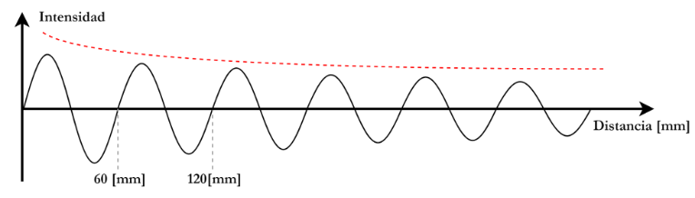

# Trabajo Práctico N.º 1: Comunicaciones 101

**Alumnos**
- García, Lautaro Misael 
- Pastrana Lizárraga, Iván
- Peretti, Federico Ariel
- Renaudo Gaggioli, Valentino
- Verdú, Melisa Noel

## 1. Fundamentos de comunicaciones

La comunicación a distancia requiere transformar la información original en una señal capaz de propagarse a través de un medio. Una señal acústica, como la voz, necesita un medio material para propagarse y presenta una atenuación considerable, por lo que no resulta adecuada para establecer comunicaciones a grandes distancias. Las ondas electromagnéticas, en cambio, permiten transportar información a grandes distancias y, dependiendo del medio y la frecuencia utilizada, pueden propagarse incluso en el vacío.

Para realizar una comunicación mediante ondas electromagnéticas, la información debe convertirse primero en una señal eléctrica y posteriormente en una onda electromagnética mediante una antena. La longitud de onda de esta radiación está relacionada con su frecuencia mediante

$$
\lambda = \frac{c}{f}
$$

donde $c$ es la velocidad de propagación de la onda electromagnética y $f$ su frecuencia.

La frecuencia de la señal original puede resultar demasiado baja para una transmisión eficiente mediante una antena. Por ejemplo, una señal de $1\text{ kHz}$ tendría una longitud de onda de aproximadamente $300 \text{ km}$, lo que conduciría a dimensiones de antena impracticables. Para resolver este inconveniente se utiliza una señal periódica de frecuencia mucho mayor, denominada **portadora**, sobre la cual se incorpora la información de la señal original o **banda base**.

Este proceso se denomina **modulación** y consiste, en términos generales, en trasladar la información desde su banda de frecuencias original hacia otra región del espectro mediante una portadora. En el receptor, el proceso inverso, denominado **demodulación**, permite recuperar la información contenida en la señal recibida.

La señal de banda base puede presentar diferentes características. Una **señal continua** está definida para todo instante de tiempo y puede adoptar valores que varían de manera continua, como ocurre con una señal eléctrica asociada a la voz. Una **señal discreta**, en cambio, está definida únicamente en determinados instantes o puede tomar un conjunto discreto de valores. Esta distinción resulta importante al estudiar los sistemas de comunicación, ya que la naturaleza de la información y de la señal condiciona las técnicas empleadas para su transmisión.

De manera general, cuando la información que modula la portadora es analógica, se habla de **modulación analógica**; cuando la información es digital, se emplean técnicas de **modulación digital**. En ambos casos, el principio fundamental es el mismo: utilizar una señal portadora para adaptar la información a las condiciones del medio de transmisión.

La portadora es una señal periódica caracterizada principalmente por su **amplitud, frecuencia y fase**. Según cuál de estos parámetros sea modificado por la información, pueden distinguirse diferentes técnicas de modulación. En las modulaciones analógicas clásicas se encuentran la **modulación de amplitud (AM)**, la **modulación de frecuencia (FM)** y la **modulación de fase (PM)**. En las técnicas digitales, esta misma idea da lugar a esquemas en los que la información modifica de manera discreta alguno de estos parámetros.

## Análisis de gráfico
En el siguiente gráfico podemos observar una onda electromagnética senoidal cuya amplitud disminuye  a medida de que aumenta la distancia de propagación  recorrida de la misma.

## Cálculo de parámetros de la onda 
**Longitud de onda ($\lambda$)**

Se conoce como **longitud de onda** a la distancia que recorre una perturbación periódica que se propaga por un medio en un ciclo. La longitud de onda también conocida como **periodo espacial** es la inversa de la frecuencia multiplicado por la velocidad de propagación de la onda en el media por el cual se propaga. 

La **magnitud** de la longitud de onda se puede determinar como la distancia entre dos máximos consecutivos de la perturbación.

$$ \lambda = 120mm - 60mm = 0,06\pi $$

**Frecuencia ($f$)**
La frecuencia es el número de repeticiones por unidad de tiempo de cualquier proceso periódico.

Como anteriormente fue desarrollada, existe la relación: 
$$
\lambda = \frac{c}{f} = \frac{3x10^8 m/s}{0,06m} = 5x10^9 GHz$$ 

## Región y banda del espectro EM
La **Unión Internacional de Telecomunicaciones (UIT)** es un organismo especializado de las Naciones Unidas responsable de muchas cuestiones relacionadas con las tecnologías de la información y las comunicaciones. El mimso define a las ondas de radio como: **"ondas electromagnéticas de frecuencias arbitrariamente Más de 3000GHz, propagado en el espacio sin guía artificial"**. Ésta última frase "propagadas en el aire sin guía artificial" significa que las ondas de radio viajan de forma libre por el aire, el vacío o el agua, en lugar de estar contenidas dentro de un cable físico, ésta aclaración sirve para separar el mundo inhalámbrico del cableado ya que la UIT solo regula las frecuencias que viajan libres por el espacio, ya que al cruzarse pueden causar interferencias entre países.

Una **banda** de radio es una banda de frecuencia pequeña (una sección contigua del rango del espectro de radio) en la que los canales se usan normalmente o se reservan para el mismo propósito. Para evitar interferencias y permitir un uso eficiente del espectro radioeléctrico, se asignan servicios similares en bandas.

Los tipos de radiación electromagnética se clasifican ampliamente en **clases (regiones, bandas o tipos)**. Esta clasificación va en el orden creciente de la longitud de onda, que es característico del tipo de radiación.

La frecuencia calculada en la onda de la imágen es de 5GHz, como este valor está comprendido en el intervalo entre 3GHz y 30GHz, la UIT la clasifica formalmente en la **Banda 10: SFH (Super High Frecuency)**. Estas frecuencias caen dentro dentro de la banda de microondas.

## 2. Transmisión de señales digitales

## 3. Modulación de señales digitales

## 4. Implementación en Packet Tracer

## 5. Conclusiones

## Referencias
