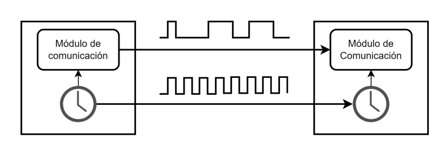
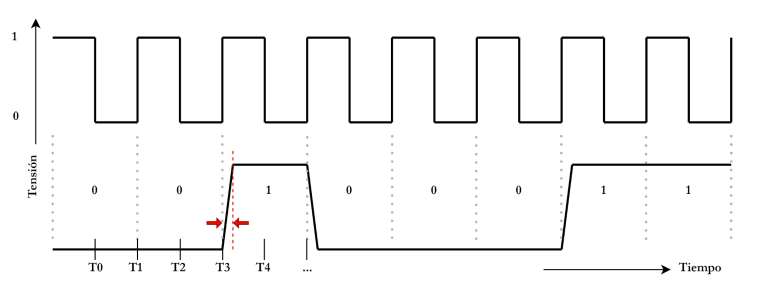
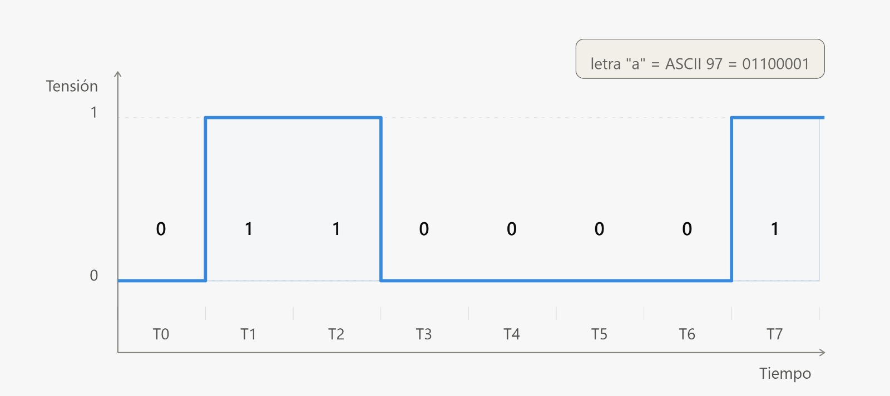
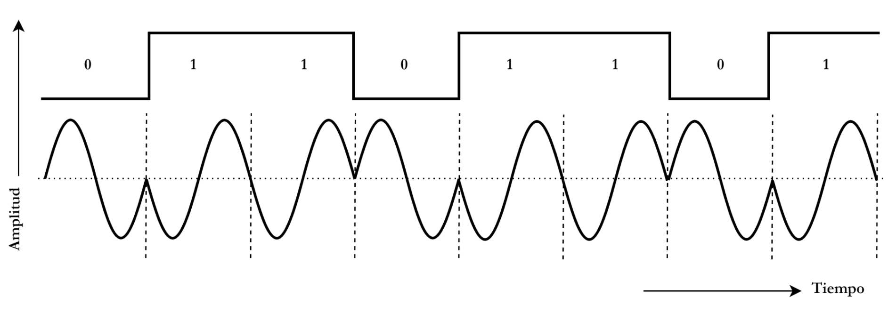
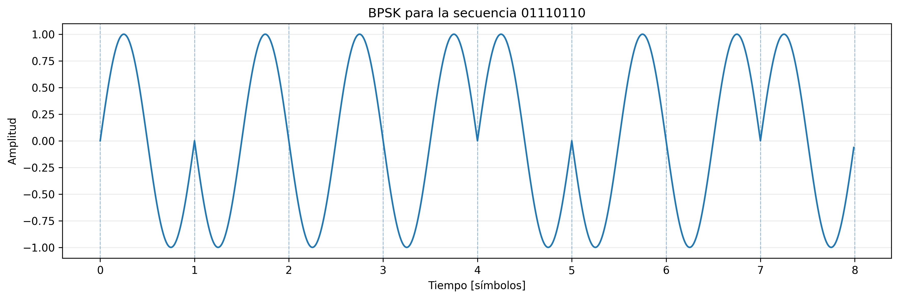
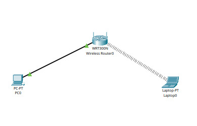
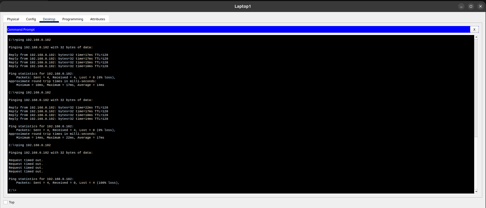
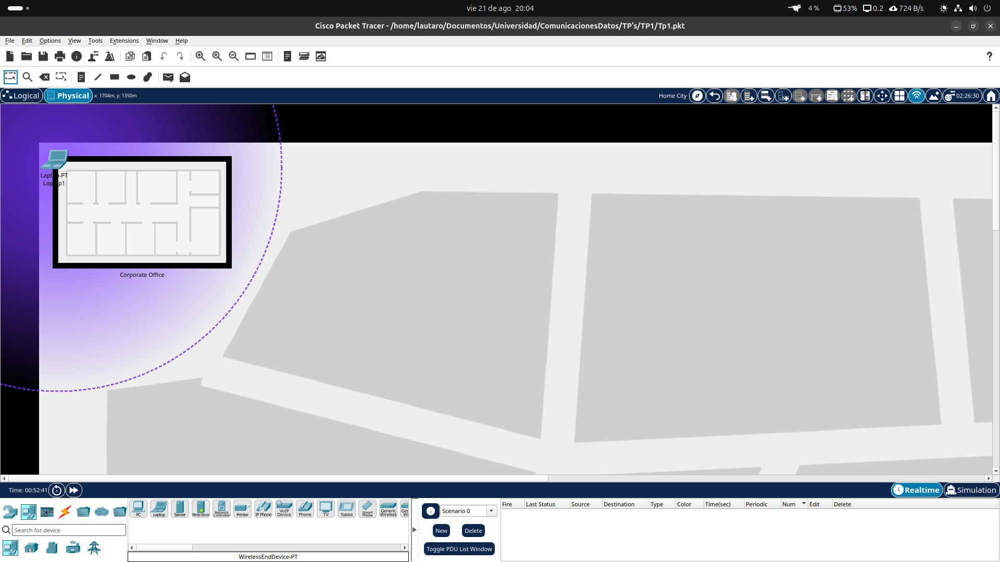
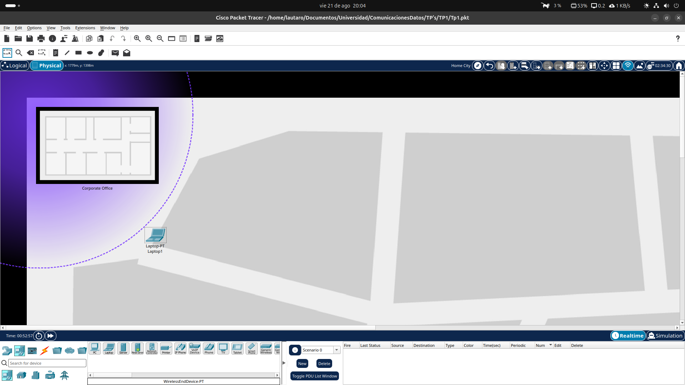

# Trabajo Práctico N.º 1: Comunicaciones 101

**Alumnos**
- García, Lautaro Misael 
- Pastrana Lizárraga, Iván
- Peretti, Federico Ariel
- Renaudo Gaggioli, Valentino
- Verdú, Melisa Noel

## 1. Fundamentos de comunicaciones

La comunicación a distancia requiere transformar la información original en una señal capaz de propagarse a través de un medio. Una señal acústica, como la voz, necesita un medio material para propagarse y presenta una atenuación considerable, por lo que no resulta adecuada para establecer comunicaciones a grandes distancias. Las ondas electromagnéticas, en cambio, permiten transportar información a grandes distancias y, dependiendo del medio y la frecuencia utilizada, pueden propagarse incluso en el vacío.

Para realizar una comunicación mediante ondas electromagnéticas, la información debe convertirse primero en una señal eléctrica y posteriormente en una onda electromagnética mediante una antena. La longitud de onda de esta radiación está relacionada con su frecuencia mediante

$$
\lambda = \frac{c}{f}
$$

donde $c$ es la velocidad de propagación de la onda electromagnética y $f$ su frecuencia.

La frecuencia de la señal original puede resultar demasiado baja para una transmisión eficiente mediante una antena. Por ejemplo, una señal de $1\text{ kHz}$ tendría una longitud de onda de aproximadamente $300 \text{ km}$, lo que conduciría a dimensiones de antena impracticables. Para resolver este inconveniente se utiliza una señal periódica de frecuencia mucho mayor, denominada **portadora**, sobre la cual se incorpora la información de la señal original o **banda base**.

Este proceso se denomina **modulación** y consiste, en términos generales, en trasladar la información desde su banda de frecuencias original hacia otra región del espectro mediante una portadora. En el receptor, el proceso inverso, denominado **demodulación**, permite recuperar la información contenida en la señal recibida.

La señal de banda base puede presentar diferentes características. Una **señal continua** está definida para todo instante de tiempo y puede adoptar valores que varían de manera continua, como ocurre con una señal eléctrica asociada a la voz. Una **señal discreta**, en cambio, está definida únicamente en determinados instantes o puede tomar un conjunto discreto de valores. Esta distinción resulta importante al estudiar los sistemas de comunicación, ya que la naturaleza de la información y de la señal condiciona las técnicas empleadas para su transmisión.

De manera general, cuando la información que modula la portadora es analógica, se habla de **modulación analógica**; cuando la información es digital, se emplean técnicas de **modulación digital**. En ambos casos, el principio fundamental es el mismo: utilizar una señal portadora para adaptar la información a las condiciones del medio de transmisión.

La portadora es una señal periódica caracterizada principalmente por su **amplitud, frecuencia y fase**. Según cuál de estos parámetros sea modificado por la información, pueden distinguirse diferentes técnicas de modulación. En las modulaciones analógicas clásicas se encuentran la **modulación de amplitud (AM)**, la **modulación de frecuencia (FM)** y la **modulación de fase (PM)**. En las técnicas digitales, esta misma idea da lugar a esquemas en los que la información modifica de manera discreta alguno de estos parámetros.

### Análisis del gráfico

El gráfico representa una onda electromagnética senoidal cuya amplitud disminuye a medida que aumenta la distancia recorrida. La disminución de amplitud representa la atenuación de la señal durante su propagación.

### Cálculo de parámetros de la onda

**Longitud de onda ($\lambda$)**

La longitud de onda es la distancia que recorre la onda durante un ciclo y puede determinarse como la distancia entre dos máximos consecutivos.

A partir del gráfico:

$$
\lambda = 120 \text{mm} - 60 \text{mm}
$$

$$
\boxed{\lambda = 60 \text{mm} = 0,06 \text{m}}
$$

**Frecuencia ($f$)**

Considerando una velocidad de propagación de $c=3 \times10^8 \text{m/s}$:

$$
f = \frac{c}{\lambda}
$$

$$
f = \frac{3\times10^8 \text{m/s}}{0,06 \text{m}}
= 5\times10^9 \text{Hz}
$$

$$
\boxed{f=5 \text{GHz}}
$$

### Región y banda del espectro electromagnético

La frecuencia obtenida, $5 \text{GHz}$, se encuentra dentro del rango de **microondas**, correspondiente a frecuencias comprendidas aproximadamente entre $3$ y $30 \text{GHz}$.

Dentro de la clasificación de bandas de radio, este rango corresponde a la **banda SHF (Super High Frequency)**.

### Dispositivos de comunicaciones en la banda SHF

La banda de $5 \text{GHz}$ es utilizada por diferentes sistemas de comunicaciones inalámbricas. Entre ellos se encuentran las redes **Wi-Fi**, particularmente aquellas que utilizan las bandas de $5 \text{GHz}$, como Wi-Fi 5 (IEEE 802.11ac) y Wi-Fi 6 (IEEE 802.11ax).

Un ejemplo de dispositivo que opera en esta banda es un **punto de acceso o router Wi-Fi de 5 GHz**.

### Fenómeno representado por la línea de trazos roja

La línea de trazos roja representa la **atenuación**, es decir, la disminución de la amplitud o potencia de una señal a medida que se propaga.

### Incidencia del fenómeno y experiencia cotidiana

La atenuación afecta a las comunicaciones Wi-Fi y limita su alcance efectivo. En una vivienda, por ejemplo, la señal suele disminuir al aumentar la distancia respecto del punto de acceso y al atravesar obstáculos como paredes, lo que puede reducir la calidad y velocidad de la conexión.

### Efecto de la atenuación en distintos medios

La atenuación está presente en diferentes medios de transmisión. En las **comunicaciones celulares**, la señal pierde potencia debido a la distancia recorrida y a obstáculos presentes en el entorno. En **cables coaxiales**, se producen pérdidas asociadas al conductor y al dieléctrico. En **fibra óptica** también existe atenuación, en este caso, las pérdidas se deben principalmente a fenómenos como la absorción y la dispersión en el material de la fibra.

## 2. Transmisión de señales digitales

Comunicar datos a través de cualquier medio es un proceso que consiste en modificar el comportamiento de una señal en el tiempo. Analicemos el siguiente sistema:

### Tipo y modo de transmisión
El esquema muestra dos módulos de comunicación conectados por dos líneas: una de ellas es de datos y la otra es de reloj, donde cada módulo posee su propio reloj sincronizado y las flechas van en un solo sentido (izquierda a derecha).

* **Modo de transmisión (Direccionalidad):** Es de modo **simplex**, es decir, los datos viajan en una sola dirección.
* **Características temporales:** Es de tipo **sincrónica**, debido a que existe una señal de reloj compartida entre ambos módulos que marca el momento exacto en el que se debe leer cada bit.
* **Formato:** Es una transmisión **serial (en serie)**, lo que significa que los bits se transmiten uno detrás de otro por una única línea de datos, no en paralelo.

### Evaluación del esquema de comunicación
#### ¿Es este el mejor paradigma si se busca transmitir datos rápidamente y de forma bidireccional?
No. Este esquema no permite la bidireccionalidad por ser de tipo simplex. Para lograr una comunicación en ambos sentidos y con mayor eficiencia, se requeriría como mínimo un esquema **Half-Duplex** (bidireccional no simultáneo) o idealmente **Full-Duplex** (bidireccional simultáneo).

### Transmisión de la cuarta letra del nombre del grupo
En la expresión más simple de señal digital, podemos pensar que un nivel de tensión "1" representa un 1 digital, y un nivel de tensión "0" representa un 0 digital. Con esto en mente, analicemos el gráfico de ejemplo donde se representa la transmisión del byte `"00100011"` (símbolo `#` en ASCII):

Si quisiéramos transmitir la **cuarta letra** del nombre del grupo (la letra **"a"**, cuyo valor en código ASCII es **97** o `01100001` en binario de 8 bits), el diagrama de la señal digital correspondiente queda representado de la siguiente manera:

### Punto de medición de la señal
Debido a que la transición de tensión no es instantánea (representada con las flechas rojas), no conviene realizar el muestreo o medición justo en los flancos de subida o de bajada, ya que en esos instantes la señal se encuentra en estado de transición y se podrían obtener lecturas erróneas.

Lo correcto es realizar la medición en el **punto medio del intervalo del bit**, dando el tiempo suficiente para que el nivel de tensión se estabilice en la línea antes del muestreo.

## 3. Modulación de señales digitales

Una señal escalonada, utilizada habitualmente para representar información digital, presenta transiciones abruptas entre sus niveles. Estas transiciones requieren la presencia de componentes de alta frecuencia. En el caso ideal de una onda cuadrada periódica, su representación espectral está compuesta por la frecuencia fundamental y una serie de armónicos impares:

$$
f_0, 3f_0, 5f_0, 7f_0,\ldots
$$

Por lo tanto, esta señal tiene un número infinito de componentes en frecuencia y, en consecuencia, su ancho de banda ideal también es infinito. Sin embargo, la amplitud de los armónicos disminuye a medida que aumenta su frecuencia, por lo que la mayor parte de la energía se concentra en las primeras componentes.

Un sistema de transmisión real no puede transportar un ancho de banda infinito. Tanto los componentes del transmisor y receptor como el propio medio de transmisión actúan como sistemas limitados en frecuencia, por lo que las componentes espectrales que se encuentran fuera de la banda disponible son atenuadas o eliminadas. En consecuencia, la señal recibida ya no conserva la forma escalonada ideal. La eliminación de los armónicos de mayor frecuencia suaviza las transiciones y produce una distorsión de la señal.

Esta limitación resulta especialmente relevante en las comunicaciones inalámbricas, donde el ancho de banda disponible está restringido tanto por las características físicas de los sistemas como por la necesidad de evitar interferencias entre diferentes servicios y usuarios del espectro radioeléctrico. Por este motivo, no resulta viable transmitir directamente todas las componentes espectrales de una señal escalonada.

La distorsión producida por la limitación del ancho de banda no implica necesariamente que la información digital se pierda. Un receptor puede seguir distinguiendo los niveles correspondientes a los bits si se conservan suficientes componentes de la señal. Sin embargo, a medida que se reduce el ancho de banda, las transiciones se vuelven más lentas y la forma de onda se aleja progresivamente de la original, aumentando la posibilidad de errores durante la detección de los símbolos.

Por estas razones, las señales digitales destinadas a transmisión inalámbrica no se transmiten normalmente como señales escalonadas ideales. Se representan mediante señales adaptadas al ancho de banda disponible y, en los sistemas inalámbricos, se emplean técnicas de **modulación** que permiten trasladarla a una banda de frecuencias apropiada para su transmisión.[1]

En síntesis, los principales inconvenientes de transmitir inalámbricamente una señal escalonada son:

* **Ancho de banda idealmente infinito:** la señal contiene una cantidad ilimitada de componentes armónicas.
* **Limitación física del canal:** los sistemas reales solamente permiten transmitir una banda finita de frecuencias.
* **Restricciones del espectro radioeléctrico:** las bandas disponibles para comunicaciones inalámbricas están limitadas para permitir la coexistencia de diferentes sistemas.
* **Distorsión de la señal:** la eliminación de componentes de alta frecuencia modifica principalmente las transiciones de la señal.
* **Posible aumento de errores:** una distorsión excesiva puede dificultar que el receptor determine correctamente los niveles o símbolos transmitidos.

La relación entre estos fenómenos puede analizarse en el dominio de la frecuencia mediante la Transformada Rápida de Fourier (FFT). El análisis permite identificar las componentes armónicas presentes en una señal escalonada y observar cómo la reducción del ancho de banda disponible afecta a su reconstrucción en el dominio temporal.

### Técnica de modulación

La técnica de modulación representada es **BPSK (Binary Phase Shift Keying)**, una técnica de modulación digital por desplazamiento de fase. En BPSK se utilizan dos fases de una señal portadora, separadas $180^\circ$, para representar los dos posibles valores binarios.

En la representación utilizada, cada bit determina la fase de la portadora:

$$
0 \rightarrow 0^\circ
$$

$$
1 \rightarrow 180^\circ
$$

Por lo tanto, un cambio de bit produce una inversión de la fase de la señal modulada.

### Modulación de una secuencia

Para la secuencia de ejemplo

$$
01110110
$$

cada bit se representa mediante una de las dos fases disponibles. Utilizando el mapeo antes visto, se obtiene:

$$
0^\circ,180^\circ,180^\circ,180^\circ,0^\circ,180^\circ,180^\circ,0^\circ
$$

La señal resultante consiste en segmentos de la onda portadora que mantienen una fase constante durante cada intervalo de símbolo. Cuando cambia el valor del bit, la fase de la portadora se desplaza $180^\circ$, produciendo una inversión de la onda.

La representación fue generada mediante una simulación en Python, utilizando una portadora senoidal y aplicando el desplazamiento de fase correspondiente a cada bit.

### Otras técnicas basadas en el mismo principio

Interpretando la consigna como una referencia a las técnicas basadas en **desplazamiento de fase (PSK)**, BPSK constituye el caso de dos fases posibles. A partir del mismo principio pueden utilizarse más estados de fase, dando lugar a técnicas de modulación $M$-PSK, entre las que se encuentran **QPSK (4-PSK)** y **8-PSK**.

Al aumentar la cantidad de fases disponibles, cada símbolo puede representar una mayor cantidad de bits. En general:

$$
\text{bits por símbolo}=\log_2(M)
$$

donde $M$ es la cantidad de estados de fase.

Por ejemplo, BPSK utiliza dos fases y transmite un bit por símbolo, mientras que QPSK utiliza cuatro fases y transmite dos bits por símbolo.

### Bit Error Rate (BER)

El **Bit Error Rate** es una medida de la cantidad de bits recibidos incorrectamente respecto de la cantidad total de bits transmitidos:

$$
BER=\frac{N_{\text{bits erróneos}}}{N_{\text{bits transmitidos}}}
$$

Por ejemplo, un BER de $10^{-4}$ significa que, en promedio, se produce un error por cada $10^4$ bits transmitidos.

En términos de BER, entre las modulaciones PSK consideradas, **BPSK presenta las mejores prestaciones**, bajo iguales condiciones de potencia y ruido. Esto puede explicarse mediante su constelación: sus dos símbolos se encuentran separados por $180^\circ$, por lo que están lo más alejados posible entre sí para una constelación PSK de amplitud determinada.

Al aumentar $M$ en una modulación $M$-PSK, los símbolos deben distribuirse entre más fases dentro de la misma circunferencia. Por lo tanto, la distancia entre símbolos vecinos disminuye, haciendo que sea más difícil distinguirlos en presencia de ruido y aumentando la probabilidad de error para una misma relación señal/ruido.

Existe, por lo tanto, un compromiso entre **eficiencia espectral** y **prestaciones frente al ruido**: aumentar el número de fases permite transmitir más bits por símbolo, pero reduce la separación entre los símbolos y, en consecuencia, empeora el BER bajo las mismas condiciones de comparación.

## 4. Implementación en Packet Tracer

### Análisis de la Configuración Inalámbrica del Router

A partir de la información extraída de la interfaz de configuración del router, se determinan los siguientes parámetros físicos y de espectro:

* **Frecuencia de Operación:** *2.412 GHz*, correspondiente al **Canal 1** asignado en la interfaz inalámbrica.
* **Región del Espectro Electromagnético:** Pertenece al espectro de **Radiofrecuencia (RF)**, específicamente a la región de **Ultra Alta Frecuencia (UHF)**, la cual abarca el rango comprendido entre $300 \text{ MHz}$ y $3 \text{ GHz}$.
* **Banda de Operación:** Opera en la banda de *2.4 GHz*.

### Comprobación de conectividad entre computadoras mediante Ping

#### Comprobación 1

Desde la computadora de escritorio (PC0), revisamos la conexión con la notebook desde la CLI mediante `ping`:

.png)

#### Comprobación 2

Desde la notebook, revisamos la conexión con la computadora de escritorio desde la CLI mediante `ping`:

.png)

### Comprobación de Cobertura Inalámbrica en la Vista Física

Se evaluó la calidad de la señal y la conectividad inalámbrica desplazando la notebook a distintas distancias del router dentro de la vista física, ejecutando pruebas de `ping` hacia la PC de escritorio (`192.168.0.102`):

#### Pruebas de Conectividad CLI

#### Análisis según ubicación física:

1. **Ubicación 1 (Dentro de la oficina):** 
   * **Estado:** Enlace óptimo.
   * **Resultado:** **0% de paquetes perdidos** / Latencia promedio: **14 ms**.
 

2. **Ubicación 2 (Límite de señal Wi-Fi):** 
   * **Estado:** Enlace operativo en el borde de cobertura.
   * **Resultado:** **0% de paquetes perdidos** / Latencia promedio: **17 ms**.

1. **Ubicación 3 (Fuera de la zona de cobertura):** 
   * **Estado:** Sin señal.
   * **Resultado:** **100% de paquetes perdidos** (`Request timed out`).

## 5. Conclusiones

Se analizaron los aspectos fundamentales de la transmisión de datos, integrando la teoría física con la simulación práctica:

* **Propagación y atenuación:** La atenuación es inherente a cualquier medio. En bandas como UHF (2.4 GHz) y SHF (5 GHz), la pérdida de potencia por distancia limita la cobertura, exigiendo un diseño adecuado entre potencia de emisión y sensibilidad del receptor.
* **Limitación del canal y modulación:** Las señales digitales escalonadas poseen un ancho de banda teóricamente infinito. Dado que los canales reales filtran las altas frecuencias y distorsionan la señal, la modulación de portadoras es esencial para transmitir información digital eficientemente.
* **Compromiso en $\text{M-PSK}$ (BER vs. Eficiencia):** Existe un balance entre velocidad y robustez frente al ruido. Mientras $\text{BPSK}$ ofrece la menor probabilidad de error ($\text{BER}$) gracias a la máxima separación entre símbolos ($180^\circ$), esquemas de mayor orden ($\text{QPSK}$, $8\text{-PSK}$) aumentan la tasa de transferencia a costa de una mayor sensibilidad a las interferencias.
* **Validación en Packet Tracer:** La simulación confirmó que la atenuación impacta de forma directa en el desempeño. Dentro del área de cobertura la pérdida de paquetes es del 0% con latencias estables, pero al superar el umbral de sensibilidad del receptor la señal se degrada por completo y la comunicación se corta.

## Referencias

**[1]** William Stallings, *Comunicaciones y redes de computadores*, 7.ª edición, capítulo 3 **“Transmisión de datos”**.
