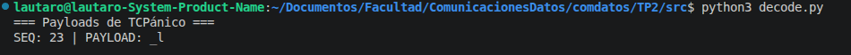
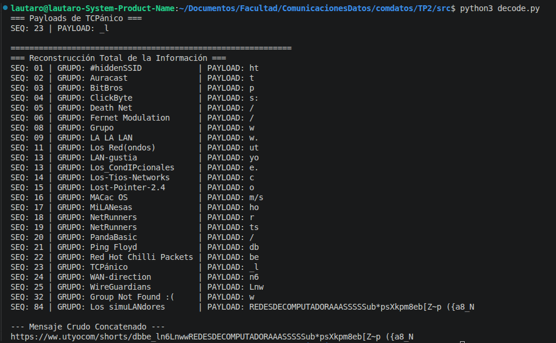
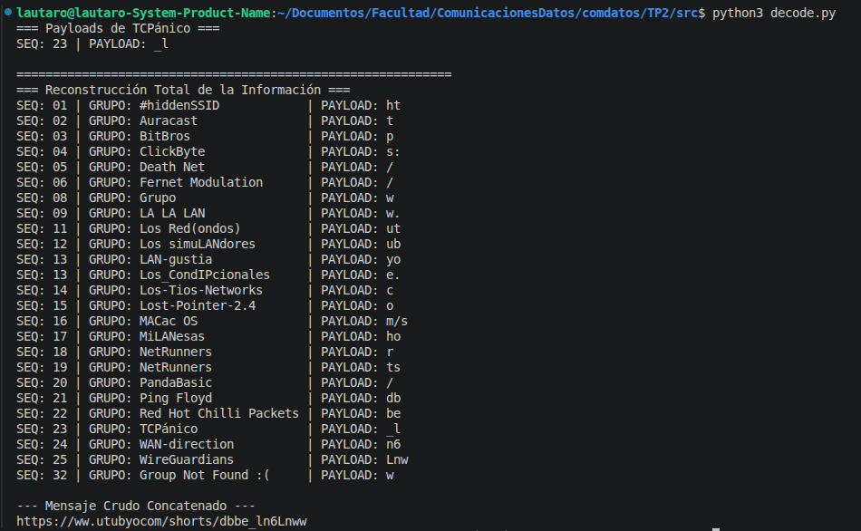

# Trabajo Práctico N.º 2: Capa Física y Capa de Enlace de Datos

**Alumnos**
- García, Lautaro Misael 
- Pastrana Lizárraga, Iván
- Peretti, Federico Ariel
- Renaudo Gaggioli, Valentino
- Verdú, Melisa Noel

---

## Fenómenos de Propagación y Movilidad en Enlaces Inalámbricos

### Efecto Doppler y Corrimiento Frecuencial en Comunicaciones Móviles

### Sensibilidad y Resiliencia según Bandas del Espectro y Modulaciones

### Desplazamiento a Alta Velocidad e Interferencia en Aeronaves Comerciales

---

## Degradación de Señal, Ruido e Interferencia en el Canal

### Ruido Impulsivo e Interferencia Electromagnética

### Vulnerabilidad y Robustez en Distintos Medios de Transmisión

### Relación Señal a Ruido (SNR) y su Relación con la Tasa de Error de Bits (BER)

---

## Estrategias Digitales de Detección, Corrección y Compensación Frecuencial

### Detección y Corrección de Errores Inducidos por Ruido en el Canal

### Compensación de Variaciones de Frecuencia y Control de Fase

---

## Sincronización, Estructura y Delimitación en la Capa de Enlace

### Sincronización a Nivel de Bit y Sincronización de Trama

### Anatomía de una Trama: Encabezado, Carga Útil y Tráiler

### Función y Relevancia del Preámbulo en la Transmisión

### Métodos para la Delimitación de Tramas en Protocolos de Enlace

---

## Procesamiento, Extracción y Reconstrucción de Tramas Binarias

### Formato de Trama y Extracción de la Carga Útil del Grupo

Para el procesamiento y análisis del archivo binario `frames.bin`, se desarrolló la herramienta de decodificación `decode.py`. El protocolo de capa de enlace especifica una estructura de cabecera rígida de $7\text{ bytes}$ de longitud:

| Campo | Extensión | Descripción |
| :--- | :--- | :--- |
| **Prefijo de Grupo** | $5\text{ bytes}$ | Cadena ASCII en minúsculas correspondiente al identificador del grupo |
| **Secuencia (SEQ)** | $1\text{ byte}$ | Entero sin signo (`uint8`) que especifica el orden del fragmento en el mensaje global. |
| **Longitud (LENGTH)** | $1\text{ byte}$ | Entero sin signo (`uint8`) que indica la cantidad de bytes que conforman la carga útil. |
| **Carga Útil (PAYLOAD)** | Variable ($N\text{ bytes}$) | Fragmento de datos transmitido por el enlace. |

#### Resultados de Extracción para TCPánico
Aplicando la rutina de filtrado por firma ASCII `b'tcpan'` sobre el búfer del binario, se identificó la trama perteneciente al grupo asignado (**TCPánico**):

* **Grupo:** `TCPánico`
* **Secuencia Identificada:** `SEQ: 23`
* **Carga Útil Extraída:** `_l`

### Reensamblado Secuencial y Reconstrucción del Mensaje Global

Para la reconstrucción del mensaje, el procesamiento de tramas se extendió a la totalidad de los $25\text{ grupos}$ registrados en la materia. Mediante la inspección secuencial del búfer del archivo binario `frames.bin`, se organizaron y ordenaron los fragmentos de carga útil hallados según su número de secuencia (`SEQ`).

#### Mapeo Completo de Tramas y Cargas Útiles Extraídas

| SEQ | Grupo | Prefijo (5B) | Carga Útil (Payload)|
| :---: | :---: | :---: | :---: |
| **01** | `#hiddenSSID` | `#hidd` | `ht` |
| **02** | `Auracast` | `aurac` | `t` |
| **03** | `BitBros` | `bitbr` | `p` |
| **04** | `ClickByte` | `click` | `s:` |
| **05** | `Death Net` | `death` | `/` |
| **06** | `Fernet Modulation` | `ferne` | `/` |
| **08** | `Grupo` | `grupo` | `w` |
| **09** | `LA LA LAN` | `la la` | `w.` |
| **11** | `Los Red(ondos)` | `los r` | `ut` |
| **12** | `Los simuLANdores` | `los s` | `ub` |
| **13** | `LAN-gustia` | `lan-g` | `yo` |
| **13** | `Los_CondIPcionales` | `los_c` | `e.` |
| **14** | `Los-Tios-Networks` | `los-t` | `c` |
| **15** | `Lost-Pointer-2.4` | `lost-` | `o` |
| **16** | `MACac OS` | `macac` | `m/s` |
| **17** | `MiLANesas` | `milan` | `ho` |
| **18** | `NetRunners` | `netru` | `r` |
| **19** | `NetRunners` | `netru` | `ts` |
| **20** | `PandaBasic` | `panda` | `/` |
| **21** | `Ping Floyd` | `ping ` | `db` |
| **22** | `Red Hot Chilli Packets` | `red h` | `be` |
| **23** | `TCPánico` | `tcpan` | `_l` |
| **24** | `WAN-direction` | `wan-d` | `n6` |
| **25** | `WireGuardians` | `wireg` | `Lnw` |
| **32** | `Group Not Found :(` | `group` | `w` |

---

#### Análisis del Ruido y Reconstrucción Lógica del Mensaje

Al ejecutar el procesamiento directo sobre el archivo binario sin filtros de desinfección, la salida por consola expone distorsiones originadas por ruido de transmisión, errores de cabecera y tramas de relleno (*padding*):

A partir de la inspección de la salida cruda, se aplicaron las siguientes deducciones para reconstruir el flujo de datos original:

1. **Pérdida de Tramas:** El grupo **Bitless** parece que no registra ninguna trama dentro del archivo binario `frames.bin`.
2. **Corrupción de Secuencia (SEQ 32 $\to$ SEQ 07):** Se detectó la trama `Group Not Found :(` etiquetada con `SEQ: 32`. Al analizar la continuidad del mensaje, se identificó que el valor $32$ deriva de una corrupción de bits en la cabecera (`SEQ`); su posición lógica real corresponde a la **secuencia 07**, aportando el fragmento `w` faltante para formar la cabecera del dominio (`www.`).
3. **Identificación y Eliminación de Relleno y Reasignación de Secuencia (SEQ 84 $\to$ SEQ 12):** En la lectura inicial del binario, la extracción arrojaba un bloque desbordado etiquetado como `SEQ: 84` atribuido al grupo **Los simuLANdores**, cuyo contenido principal consistía en la cadena de relleno `REDESDECOMPUTADORAAASSSSS...`. Sin embargo, al inspeccionar los caracteres de la carga útil extraída, se aisló la subcadena legítima **`ub`**. Al analizar el reensamblado global, se observó que entre la `SEQ: 11` (`ut`) y la `SEQ: 13` (`e.`), el único fragmento con sentido semántico para formar el término `youtube` era la carga útil **`ub`**, por lo cual se dedujo que la trama sufrió tanto la inyección de *padding* de capa física como una corrupción en el byte de secuencia (`84` $\to$ `12`). Se justificó así la inclusión de la regla condicional en el script para reasignar la trama a la **secuencia 12** y conservar la carga útil limpia `"ub"`.
4. **Colisiones y Duplicación de Secuencias:** La secuencia `13` se encontró duplicada en el buffer (`yo` de *LAN-gustia* y `e.` de *Los_CondIPcionales*).

#### Resultado Final Reconstruido

* **Mensaje Crudo Concatenado:**  
  `https://ww.utubyocom/shorts/dbbe_ln6Lnww`

* **Mensaje Reconstruido:**  
  `https://www.youtube.com/shorts/dbbe_ln6Lnw`
