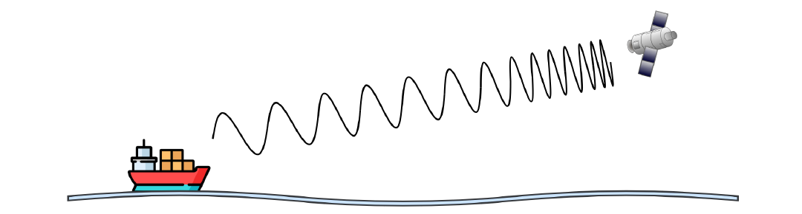
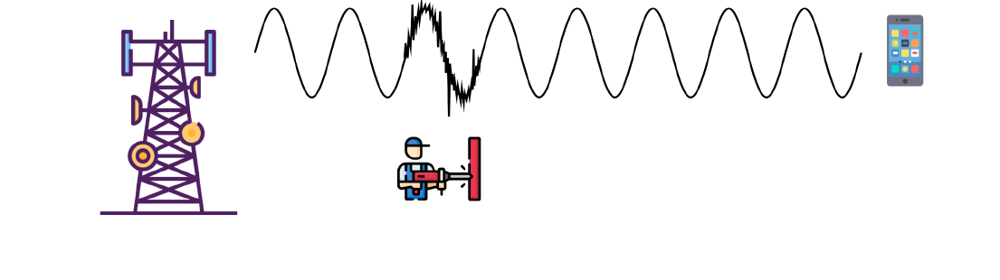

# Trabajo Práctico N.º 2: Capa Física y Capa de Enlace de Datos

**Alumnos**
- García, Lautaro Misael 
- Pastrana Lizárraga, Iván
- Peretti, Federico Ariel
- Renaudo Gaggioli, Valentino
- Verdú, Melisa Noel

---

## Fenómenos de Propagación y Movilidad en Enlaces Inalámbricos

  

### Efecto Doppler y Corrimiento Frecuencial en Comunicaciones Móviles

El fenómeno físico representado en la figura corresponde al **Efecto Doppler** (o corrimiento Doppler) en comunicaciones inalámbricas y satelitales. Este efecto describe el cambio aparente en la frecuencia y en la longitud de onda recibidas debido a la existencia de velocidad relativa entre la fuente transmisora y el receptor a lo largo de la línea de vista.

Cuando el emisor y el receptor reducen su distancia relativa (aproximación), cada frente de onda sucesivo se emite desde una posición más cercana que el anterior, provocando una compresión espacial de la longitud de onda y un consecuente incremento en la frecuencia percibida por el receptor ($f_{\text{recibida}} > f_{\text{transmitida}}$). Por el contrario, cuando se incrementa la distancia (alejamiento), los frentes de onda se dilatan en el medio, reduciendo la frecuencia recibida. En el gráfico se observa cómo los frentes de onda llegan progresivamente más próximos entre sí al receptor durante la aproximación, representando el incremento de la frecuencia recibida.

La relación fundamental para el cálculo de la frecuencia percibida y del desplazamiento Doppler ($\Delta f_d$) se modela analíticamente como:

$$
f_{\text{recibida}} = f_{\text{transmitida}} \cdot \left(1 + \frac{v_r}{c}\right) \implies \Delta f_d = f_c \cdot \frac{v_r}{c} = f_c \cdot \frac{v}{c} \cdot \cos(\theta)
$$

donde:
- $f_c$ es la frecuencia portadora nominal emitida.
- $v_r$ es la componente de velocidad radial relativa proyectada sobre la línea de vista directa (*Line-of-Sight*, LOS) entre el transmisor y el receptor.
- $v$ es la velocidad relativa total y $\theta$ es el ángulo entre el vector de movimiento y el enlace visual.
- $c$ es la velocidad de propagación de la luz en el vacío ($3 \times 10^8\text{ m/s}$).

Este fenómeno constituye la principal restricción de diseño de radiofrecuencia en sistemas de satélites de órbita terrestre baja (**LEO**, *Low Earth Orbit*), como Starlink, OneWeb o Kuiper, donde los vehículos orbitan a altitudes de $500\text{ a }1200\text{ km}$ a velocidades del orden de $7,5\text{ a }7,8\text{ km/s}$ ($\approx 27.000\text{ km/h}$). Durante el paso orbital de un satélite LEO (que dura apenas entre 5 y 10 minutos), la velocidad radial traza una **curva en S**: es máxima positiva al asomar en el horizonte (acercamiento), se anula momentáneamente en el cenit o punto de máxima elevación (movimiento puramente transversal) y pasa a ser máxima negativa al ocultarse en el horizonte. En transmisiones en **banda Ka** ($20\text{ GHz}$), este comportamiento induce desviaciones de hasta $\pm 500\text{ kHz}$ con una excursión de frecuencia total de hasta $1\text{ MHz}$ a lo largo de un solo pase, con tasas de variación (*Doppler drift rate*) de hasta $40\text{ kHz/s}$, lo que descalibra severamente los circuitos de recuperación de portadora (*Carrier Frequency Offset*, CFO) y altera el sincronismo temporal de los símbolos en hasta $\pm 25\text{ ppm}$ ($\pm 2.500\text{ símbolos/s}$ para una tasa de $100\text{ Msym/s}$).[1]

### Sensibilidad y Resiliencia según Bandas del Espectro y Modulaciones

Debido a que el desplazamiento Doppler absoluto ($\Delta f_d$) es estrictamente proporcional a la frecuencia de la portadora ($f_c$), el impacto técnico se distribuye desigualmente según la banda espectral y la arquitectura orbital:

- **Bandas de mayor sensibilidad (menor resiliencia):** Las frecuencias elevadas de microondas y ondas milimétricas en las bandas **SHF** y **EHF** sufren las mayores variaciones absolutas. En enlaces de banda **Ka** ($20\text{ GHz}$), el corrimiento alcanza $\pm 500\text{ kHz}$; en banda **Ku** ($12\text{ GHz}$), ronda los $\pm 300\text{ kHz}$ ($\approx 60\%$ del valor en Ka). Estas magnitudes exceden ampliamente el ancho de captura de demoduladores satelitales convencionales (como DVB-S2X), demandan bandas de guarda mayores (de hasta $1\text{ MHz}$) para evitar el solapamiento de canales adyacentes y destruyen la ortogonalidad en esquemas multiportadora como OFDM debido a la interferencia entre subportadoras (ICI).
- **Bandas de mayor resiliencia:** En la banda **L** ($1,5\text{ GHz}$, utilizada en servicios móviles satelitales tradicionales como Inmarsat o Iridium para voz), el corrimiento máximo se reduce a sólo $\approx \pm 37,5\text{ kHz}$ ($7,5\%$ del valor en Ka). En bandas más bajas (**HF**, **VHF** y **UHF** baja, de $3\text{ a }300\text{ MHz}$), los corrimientos se limitan a unos pocos hercios o centenas de hercios, resultando despreciables para los anchos de canal estándar.
- **Satélites Geoestacionarios (GEO):** Al orbitar a $35.786\text{ km}$ en sincronismo con la rotación terrestre, su velocidad radial relativa con terminales terrestres proviene únicamente de imperfecciones de mantenimiento de posición (*station-keeping*, $\pm 0,05^\circ$), resultando en velocidades relativas de apenas $\sim 1\text{ m/s}$ y desviaciones Doppler marginales de $\pm 40\text{ a }\pm 67\text{ Hz}$ en bandas Ku/Ka, las cuales son absorbidas sin dificultad por los bucles de enganche de fase estándar.

Para mitigar el efecto en constelaciones LEO modernas, se implementa una arquitectura híbrida:
  1. **Compensación en lazo abierto (*Open-Loop*):** El transmisor precorrige su frecuencia calculando la trayectoria del satélite a partir de datos de efemérides orbitales y posición GPS, reduciendo el error residual a menos de $1\text{ kHz}$.
  2. **Seguimiento en lazo cerrado (*Closed-Loop*):** El receptor rastrea y elimina en tiempo real la desviación residual mediante lazos de control automático de frecuencia (**AFC**) y lazos de enganche de fase (**PLL**).[1]

### Desplazamiento a Alta Velocidad e Interferencia en Aeronaves Comerciales

La restricción que prohíbe el uso activo de telefonía celular comercial a bordo de aeronaves en vuelo responde a dos factores electromagnéticos y de ingeniería de redes:

1. **Interferencia electromagnética (EMI) en la aviónica de a bordo:** En determinadas condiciones de vuelo, especialmente cuando el terminal se encuentra lejos de las estaciones base terrestres, puede incrementar su potencia de transmisión para mantener el enlace. Las emisiones simultáneas de múltiples dispositivos pueden aumentar el riesgo de interferencias electromagnéticas con los sistemas de comunicaciones, navegación y otros equipos electrónicos de la aeronave. Por este motivo, las transmisiones de los dispositivos móviles se encuentran sujetas a restricciones durante determinadas fases del vuelo.
2. **Efecto Doppler cinemático y saturación de la red terrestre:** A velocidades de crucero comercial ($\approx 800\text{ a }900\text{ km/h} = 250\text{ m/s}$), el movimiento del avión aporta un corrimiento Doppler adicional propio de hasta $\pm 1,7\text{ kHz}$ en frecuencias de microondas. Además, la altitud de vuelo otorga al móvil una línea de vista directa (LOS) sin obstáculos con decenas de estaciones base terrestres al mismo tiempo. La alta velocidad de desplazamiento genera una tasa crítica de intentos de traspaso de celda (**hand-overs**) entre múltiples torres por minuto y desalineaciones de sincronismo frecuencial, provocando la congestión y sobrecarga del plano de control y señalización de la red celular terrestre, degradando el servicio para los usuarios en tierra.

---

## Degradación de Señal, Ruido e Interferencia en el Canal

### Ruido Impulsivo e Interferencia Electromagnética

### Vulnerabilidad y Robustez en Distintos Medios de Transmisión

### Relación Señal a Ruido (SNR) y su Relación con la Tasa de Error de Bits (BER)

---

## Estrategias Digitales de Detección, Corrección y Compensación Frecuencial

### Detección y Corrección de Errores Inducidos por Ruido en el Canal

### Compensación de Variaciones de Frecuencia y Control de Fase

---

## Sincronización, Estructura y Delimitación en la Capa de Enlace

### Sincronización a Nivel de Bit y Sincronización de Trama

### Anatomía de una Trama: Encabezado, Carga Útil y Tráiler

### Función y Relevancia del Preámbulo en la Transmisión

### Métodos para la Delimitación de Tramas en Protocolos de Enlace

---

## Procesamiento, Extracción y Reconstrucción de Tramas Binarias

### Formato de Trama y Extracción de la Carga Útil del Grupo

### Reensamblado Secuencial y Reconstrucción del Mensaje Global

---

## Referencias

**[1]** SatCom Index (2026). *Satellite Doppler Shift Explained: Why Frequency Changes in LEO Satellite Communication*. https://www.satcomindex.com/blog/satellite-doppler-shift-explained  

