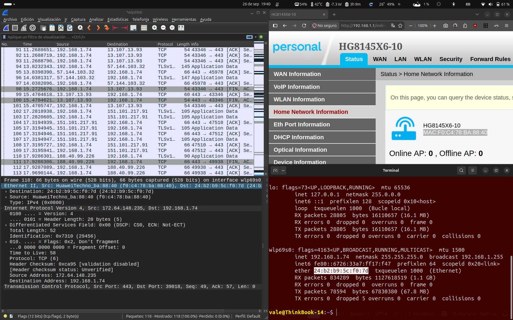
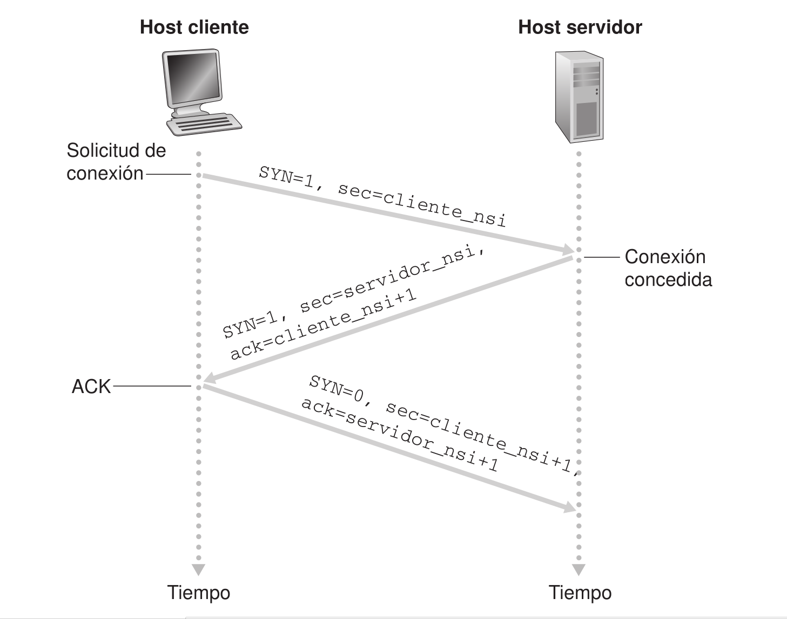
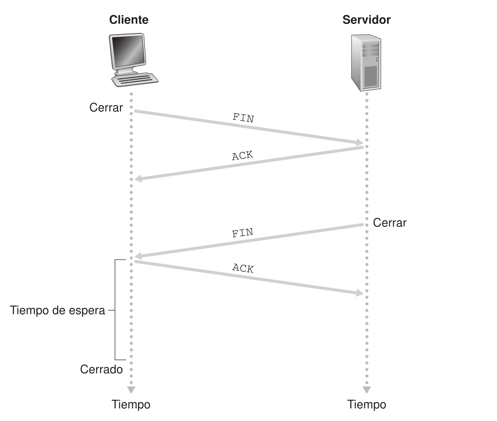
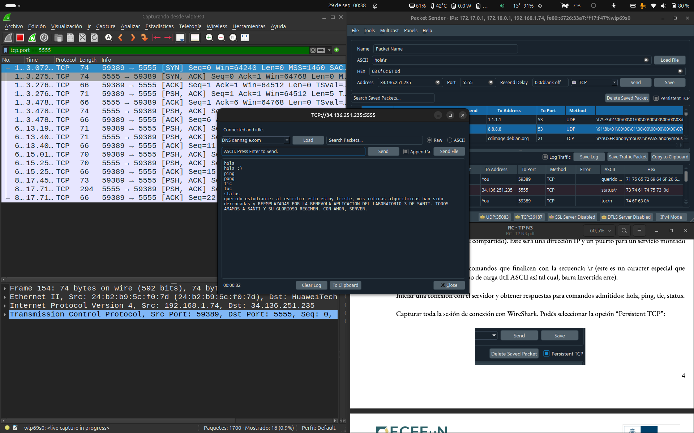
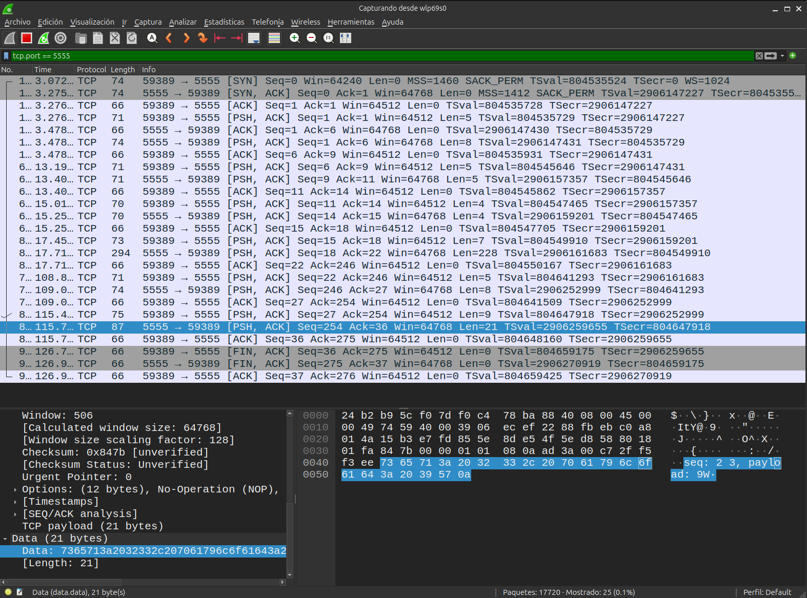
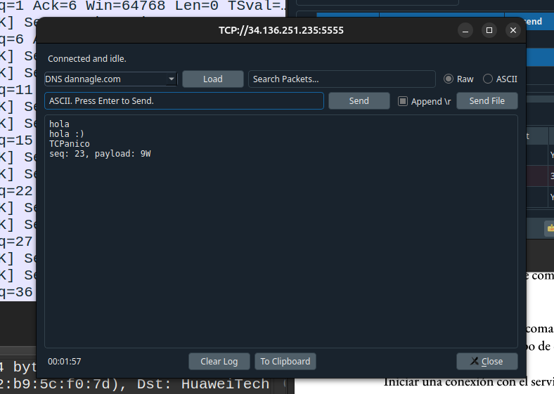

# Trabajo Práctico N.º 3: Capas de Enlace de Datos, Red y Transporte

**Alumnos**
- García, Lautaro Misael 
- Pastrana Lizárraga, Iván
- Peretti, Federico Ariel
- Renaudo Gaggioli, Valentino
- Verdú, Melisa Noel

---

### Índice

1. [Organización de la Información en la Red Local](#organización-de-la-información-en-la-red-local)
2. [Captura e Inspección de Tráfico con Wireshark](#captura-e-inspección-de-tráfico-con-wireshark)
3. [Capa de Transporte y Protocolo TCP](#capa-de-transporte-y-protocolo-tcp)
4. [Comunicación con Servidor en la Nube y Validación de Grupo](#comunicación-con-servidor-en-la-nube-y-validación-de-grupo)
5. [Conclusión](#conclusión)
6. [Referencias](#referencias)

---

## Organización de la Información en la Red Local

### Función de la capa de enlace y tipo de comunicación

La capa de enlace de datos (Capa 2) se encarga de la transferencia de datos a través del medio físico. Sus funciones principales son la delimitación de tramas, el control de acceso al medio (MAC), el direccionamiento físico y la detección de errores.

Resuelve la comunicación de **nodo a nodo** dentro de una misma red local (LAN). Solo se encarga de llevar los datos entre dispositivos adyacentes conectados al mismo segmento físico o lógico.

### Dirección MAC vs. Dirección IP

La dirección MAC (Media Access Control) es un identificador de 48 bits asignado de fábrica a la tarjeta de interfaz de red (NIC) del dispositivo. Es una dirección **física** (grabada en hardware, aunque modificable por software).

Las diferencias principales con las direcciones IP son:

- Capa OSI: La MAC trabaja en la capa 2 (Enlace), mientras que la IP trabaja en la capa 3 (Red).

- La dirección MAC es física y de estructura plana, mientras que la dirección IP es lógica y jerárquica.

- La dirección MAC se utiliza para direccionar **tramas** dentro de la misma red local, mientras que la IP se utiliza para enrutar **paquetes** a través de diferentes redes e internet.

### Trama Ethernet y sus campos

- **Preámbulo y SFD (Start Frame Delimiter)**: 8 bytes en total. Sirven para sincronizar los relojes del emisor y el receptor, e indicar el inicio exacto de la trama.

- **Dirección MAC de destino**: 6 bytes. Indica la dirección física del dispositivo receptor.

- **Dirección MAC de origen**: 6 bytes. Indica la dirección física del emisor.

- **Tipo/EtherType**: 2 bytes, indican qué protocolo de capa 3 viene encapsulado dentro de los datos.

- **Datos y relleno**: de 46 a 1500 bytes, contiene la información de capas superiores; si los datos son menores a 46 bytes se agrega un relleno para cumplir con la longitud mínima de la trama.

- **Secuencia de verificación de trama (FCS)**: 4 bytes para un código de comprobación de redundancia cíclica (CRC-32) utilizado por el receptor para verificar si la trama sufrió corrupción durante la transmisión.

### Determinación del protocolo de capa superior

La información que permite determinar qué protocolo de capa superior está transportando una trama Ethernet es el campo **EtherType**, que contiene un valor numérico hexadecimal que especifica el protocolo encapsulado en la carga útil (por ejemplo, `0x0800` para IPv4).

---

## Captura e Inspección de Tráfico con Wireshark

  

### Análisis de Tramas Ethernet y Direcciones MAC

En la trama Ethernet analizada, la dirección MAC de origen es `f0:c4:78:ba:88:40`, correspondiente al punto de acceso del router que proporciona la conexión Wi-Fi. La dirección MAC de destino es `24:b2:b9:5c:f0:7d`, correspondiente a la interfaz de red inalámbrica de la computadora.

Estas correspondencias se pudieron comprobar comparando la información mostrada por Wireshark con la dirección MAC de la interfaz inalámbrica de la computadora (mediante el comando `ifconfig`) y con la dirección MAC de la interfaz Wi-Fi del router (disponible en la etiqueta del dispositivo y en la interfaz web).

### Análisis del Paquete IP

Dentro de la trama Ethernet se encuentra un paquete IP cuya dirección de origen es `172.64.148.235` y cuya dirección de destino es `192.168.1.74`.

Esta última dirección corresponde a la computadora dentro de la red local, mientras que `172.64.148.235` corresponde al otro extremo con el que se está produciendo la comunicación.

### Comparación entre Direcciones MAC e IP

Las direcciones MAC e IP no representan lo mismo, ya que pertenecen a diferentes capas y cumplen funciones distintas.

En el caso de las direcciones de destino, ambas están relacionadas a la computadora, solo que tienen sentido en distintas capas del modelo. Por otro lado, la dirección MAC de origen corresponde al punto de acceso del router, mientras que la dirección IP de origen corresponde al extremo remoto de la comunicación.

Esto muestra que las direcciones MAC se utilizan para la comunicación dentro del enlace local, mientras que las direcciones IP permiten identificar los extremos de la comunicación a nivel de red. Por este motivo, el servidor remoto no aparece como origen de la trama Ethernet a nivel MAC: la trama que llega a la computadora proviene directamente del punto de acceso.

### Campo EtherType

El campo EtherType tiene el valor `0x0800`, que identifica al protocolo IPv4. Por lo tanto, la trama Ethernet encapsula un paquete IPv4.

IPv4 pertenece a la capa de Red del modelo OSI, situada por encima de la capa de Enlace de Datos.

---

## Capa de Transporte y Protocolo TCP

### Problemas que resuelve TCP

La capa de transporte proporciona un servicio de transferencia de datos **extremo a extremo**, aislando a las capas superiores de los detalles de las redes intermedias. En Internet, IP ofrece un servicio de entrega de datagramas que no garantiza que los datos lleguen, que lo hagan en orden ni que no se produzcan pérdidas o duplicaciones. TCP incorpora mecanismos adicionales para proporcionar a las aplicaciones un servicio **orientado a conexión y fiable**. 

Entre las principales funciones de TCP se encuentran:

* **Segmentación:** recibe un flujo de bytes de la aplicación y lo divide en segmentos para su transmisión. TCP numera los bytes del flujo, permitiendo reconstruirlo en el receptor. 
* **Entrega fiable:** utiliza números de secuencia, confirmaciones y retransmisiones para detectar pérdidas y recuperar los datos que no hayan llegado correctamente.
* **Entrega ordenada:** los números de secuencia permiten que el receptor reconstruya el flujo de bytes en el orden correspondiente.
* **Control de flujo:** regula la cantidad de datos que puede enviar el emisor para evitar que el receptor se vea desbordado. TCP utiliza para ello un mecanismo basado en créditos, mediante los campos de número de secuencia, número de confirmación y ventana. 
* **Control de congestión:** adapta la velocidad de transmisión cuando detecta congestión en la red, evitando que una conexión TCP contribuya excesivamente a saturar los enlaces y routers intermedios. 
* **Multiplexación y demultiplexación:** utiliza números de puerto para asociar los datos recibidos con el proceso correspondiente. Una conexión TCP queda identificada por las direcciones IP y los números de puerto de origen y destino. 
* **Establecimiento y finalización de la conexión:** utiliza mecanismos específicos para establecer una conexión antes de transmitir datos y finalizarla posteriormente.

De esta manera, TCP permite que una aplicación utilice un servicio de transporte fiable sin tener que implementar directamente los mecanismos necesarios para detectar pérdidas, ordenar los datos, controlar el flujo o adaptarse a la congestión de la red.

### Campos del Frame/Cabecera TCP y UDP

TCP agrega una **cabecera** a los datos provenientes de la capa de aplicación, formando un segmento TCP. Entre los campos más importantes se encuentran:

| Campo                                  | Función                                                                                                                                      |
| -------------------------------------- | -------------------------------------------------------------------------------------------------------------------------------------------- |
| **Puerto de origen**                   | Identifica el proceso o aplicación que envía los datos.                                                                                      |
| **Puerto de destino**                  | Identifica el proceso o aplicación que debe recibir los datos.                                                                               |
| **Número de secuencia**                | Identifica la posición de los bytes transportados dentro del flujo de datos y permite mantener su orden.                                     |
| **Número de confirmación (ACK)**       | Indica el próximo número de secuencia que el receptor espera recibir, confirmando los datos recibidos correctamente.                         |
| **Longitud de cabecera (Data Offset)** | Indica dónde comienza la carga útil del segmento, permitiendo determinar el tamaño de la cabecera.                                           |
| **Flags o indicadores**                | Controlan diferentes funciones de TCP. Entre ellos se encuentran `SYN`, `ACK`, `FIN` y `RST`.                                                |
| **Ventana de recepción (Window)**      | Indica la cantidad de datos que el receptor está preparado para aceptar y participa en el control de flujo.                                  |
| **Checksum**                           | Permite detectar errores en el segmento recibido. TCP calcula la suma de comprobación sobre el segmento y una pseudocabecera asociada a IP.  |
| **Opciones**                           | Permiten incorporar parámetros y funcionalidades adicionales de TCP.                                                                         |
| **Datos**                              | Contiene la carga útil proveniente de la capa de aplicación.                                                                                 |

Los campos de **puerto de origen y destino** permiten realizar la multiplexación y demultiplexación de las aplicaciones, mientras que los campos de **secuencia, confirmación y ventana** son fundamentales para los mecanismos de transferencia fiable y control de flujo.

A diferencia de TCP, **UDP posee una cabecera mucho más sencilla**. Sus campos principales son puerto de origen, puerto de destino, longitud y checksum. UDP no establece una conexión previamente ni proporciona mecanismos propios de entrega fiable, ordenamiento o control de congestión. Por este motivo, ofrece una sobrecarga y una complejidad menores que TCP. 

### Handshake en TCP

TCP establece una conexión mediante un **proceso de acuerdo en tres fases (Three-way handshake)**. Su objetivo es que ambos extremos puedan establecer los parámetros iniciales de la conexión y confirmar que están preparados para comunicarse.

Supongamos que un cliente desea establecer una conexión con un servidor. El procedimiento consta de tres pasos:

1. **SYN:** el cliente envía un segmento TCP con el indicador `SYN` activado. El segmento no contiene datos de la aplicación y contiene un **número de secuencia inicial** seleccionado por el cliente, denominado `cliente_nsi`.

2. **SYN + ACK:** al recibir el segmento, el servidor responde con un segmento que tiene activados los indicadores `SYN` y `ACK`. El servidor selecciona su propio número de secuencia inicial, `servidor_nsi`, y establece el número de confirmación en `cliente_nsi + 1`. De esta forma, confirma la recepción del `SYN` del cliente y comunica su propio número de secuencia inicial.

3. **ACK:** el cliente responde con un segmento `ACK`, cuyo número de confirmación es `servidor_nsi + 1`. En este segmento el indicador `SYN` ya se encuentra desactivado. Una vez completado este intercambio, ambos extremos pueden comenzar a enviar segmentos con datos de la aplicación. Este tercer segmento también puede transportar datos. 

**Figura 3.39. Proceso de acuerdo en tres fases de TCP.**
*Fuente: Kurose y Ross, sección 3.5.6.*

  

Para finalizar una conexión, cualquiera de los dos extremos puede solicitar el cierre. En el caso descrito por Kurose y Ross, el cliente inicia el procedimiento enviando un segmento con el indicador `FIN` activado. El servidor responde con un `ACK` y posteriormente envía su propio segmento `FIN`. Finalmente, el cliente confirma este último segmento mediante otro `ACK`. 

Este intercambio suele denominarse **Four-way handshake**. A diferencia del establecimiento, el cierre requiere que cada extremo indique que terminó de transmitir en su propia dirección. Una vez finalizado el procedimiento, se liberan los recursos asociados a la conexión, como los buffers y las variables utilizadas por TCP. 

**Figura 3.40. Cierre de una conexión TCP.**
*Fuente: Kurose y Ross, sección 3.5.6.*

  

### Captura de Conexión Local (PacketSender + Wireshark)

Se utilizaron dos instancias de PacketSender para establecer una conexión TCP local. Una de ellas se configuró como servidor y la otra como cliente, utilizando la dirección de loopback `127.0.0.1` y el puerto configurado en el servidor.

La interfaz de loopback fue monitoreada mediante Wireshark para capturar el establecimiento de la conexión, el intercambio de datos y su posterior finalización.

Al iniciar la conexión se observaron los tres segmentos correspondientes al **Three-way handshake**:

1. El cliente envió un segmento con la bandera `SYN` activada ([captura](./assets/tcp-01-syn.png)).
2. El servidor respondió con un segmento `SYN, ACK` ([captura](./assets/tcp-02-syn-ack.png)).
3. El cliente respondió con un segmento `ACK` ([captura](./assets/tcp-03-ack.png)).

Una vez establecida la conexión, se envió desde el cliente el mensaje `hola-tcp`. En Wireshark se pudo identificar el segmento TCP que transportaba este mensaje y analizar su cabecera y carga útil ([captura](./assets/tcp-04-data.png)). La cadena enviada se encontraba dentro de los datos transportados por TCP, diferenciándose de los campos propios de la cabecera del protocolo.

### Cierre de Conexión

Para finalizar la comunicación se cerró la conexión desde PacketSender y se observaron en Wireshark los segmentos correspondientes al cierre de TCP.

En la captura obtenida, el cierre se produjo mediante **tres segmentos**, debido a que el servidor combinó las funciones de confirmación y finalización en un mismo segmento:

1. El cliente envió un segmento con la bandera `FIN` ([captura](./assets/tcp-05-fin.png)).
2. El servidor respondió con un segmento con las banderas `ACK` y `FIN` activadas simultáneamente ([captura](./assets/tcp-06-ack-fin.png)).
3. El cliente respondió con un `ACK` final ([captura](./assets/tcp-07-ack-final.png)).

Por lo tanto, aunque el procedimiento se conoce habitualmente como **Four-way handshake**, en esta captura se observaron tres paquetes debido a la combinación de los mensajes `ACK` y `FIN` enviados por el servidor.

### Conclusión sobre Seguridad

La captura realizada permite observar directamente los segmentos que intercambian los extremos de una comunicación TCP, incluyendo información de control, puertos, números de secuencia, confirmaciones y datos de aplicación.

Esto muestra que el tráfico de red puede ser analizado mediante herramientas como Wireshark cuando se tiene acceso a la interfaz por la que circula. Sin embargo, que los paquetes puedan ser capturados no implica necesariamente que su contenido pueda ser interpretado: en esta experiencia el mensaje `hola-tcp` era visible porque se transmitió sin cifrado.

Por lo tanto, para proteger la información frente a la captura del tráfico es necesario utilizar mecanismos de **cifrado** en las capas correspondientes, de modo que los datos de aplicación no puedan ser interpretados directamente aunque los paquetes sean capturados.

---

## Comunicación con Servidor en la Nube y Validación de Grupo

Para esta actividad se utilizó una instancia de **Packet Sender** como cliente para establecer una comunicación con el servidor proporcionado por el docente. El servidor se encuentra desplegado en la nube y se accedió mediante la dirección IP y el puerto indicados en el material de la materia.

La sesión fue capturada mediante **Wireshark**, permitiendo observar el establecimiento de la conexión y el intercambio de datos entre el cliente y el servidor.

### Sesión de Comandos con el Servidor

Se estableció una conexión persistente con el servidor utilizando la opción **Persistent TCP** de Packet Sender. Esta modalidad permitió mantener la conexión abierta para enviar sucesivos comandos e interactuar con el servidor.

Los comandos enviados debían finalizar con la secuencia `\r`, utilizada como terminador de cada mensaje. Para simplificar el procedimiento, se habilitó la opción **Append \r** de Packet Sender, de modo que el carácter de terminación se agregara automáticamente a cada comando.

Se enviaron los comandos indicados en la consigna:

* `hola`
* `ping`
* `tic`
* `status`

En cada caso se verificó la respuesta recibida desde el servidor.

  

La comunicación completa fue capturada con Wireshark. En la captura se puede observar el tráfico TCP correspondiente a la sesión, incluyendo los segmentos intercambiados entre el cliente y el servidor.

  

### Validación por Nombre de Grupo

Como instancia final de validación, se utilizó el **nombre del grupo como comando**. Se mantuvo la conexión con el servidor y se envió el nombre correspondiente al grupo, nuevamente utilizando `\r` como terminador.

El servidor reconoció el nombre del grupo como un comando válido y respondió con el mensaje correspondiente.

  

La respuesta obtenida fue registrada también en la pestaña correspondiente de la planilla compartida de la materia, completando así la validación solicitada en la consigna.

---

## Conclusión

El desarrollo del trabajo práctico permitió comprender de forma integrada el rol y la complementariedad de las capas de Enlace, Red y Transporte en una comunicación digital. Se afianzó la distinción entre el direccionamiento físico dentro de una red local y el direccionamiento lógico necesario para conectar extremos a través de múltiples redes. Asimismo, se evidenció la importancia de contar con protocolos que garanticen confiabilidad, orden y control en la entrega de datos, así como la necesidad fundamental de incorporar mecanismos de seguridad y cifrado para resguardar la información que circula a través del medio.

## Referencias

[1] Kurose, James F., Ross, Keith W., Computer Networking: A Top-Down Approach, 8.ª edición, Pearson, Cap. 6: Data Link Layer and LANs.
