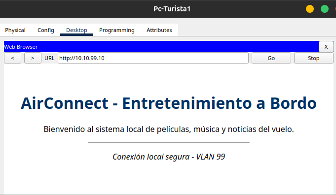
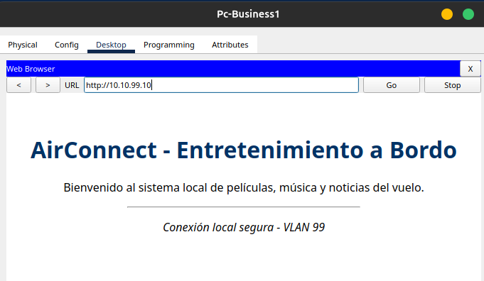
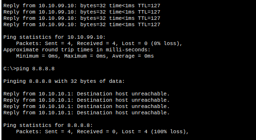
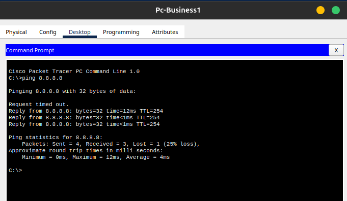
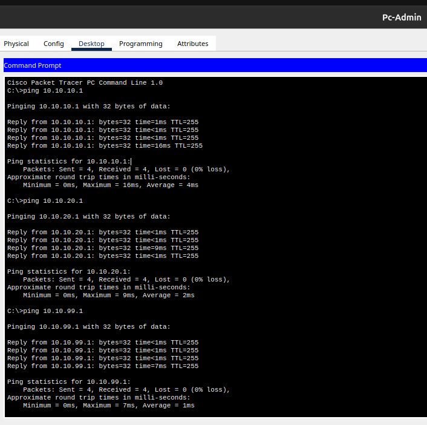

# Trabajo Práctico N.º 4: Capas de Acceso en Redes Locales, Protocolos y Fundamentos

**Alumnos**
- García, Lautaro Misael 
- Pastrana Lizárraga, Iván
- Peretti, Federico Ariel
- Renaudo Gaggioli, Valentino
- Verdú, Melisa Noel

---

### Índice

1. [Alcance de Redes y Virtualización](#alcance-de-redes-y-virtualización)
2. [Implementación Básica de Conmutación y Segmentación por VLANs](#implementación-básica-de-conmutación-y-segmentación-por-vlans)
3. [Despliegue y Arquitectura de Red LAN a Bordo de una Aeronave](#despliegue-y-arquitectura-de-red-lan-a-bordo-de-una-aeronave)
4. [Conclusión](#conclusión)
5. [Referencias](#referencias)

---

## Alcance de Redes y Virtualización

### Clasificación de Redes según su Alcance

### Fundamentos y Clasificación de Redes LAN Virtuales (VLANs)

### Estándar IEEE 802.1Q y Mecanismo de Tagging

---

## Implementación Básica de Conmutación y Segmentación por VLANs

Topología de Red y Tabla de Direccionamiento a implementar:


---

Topología implementada:


### Configuración de Seguridad Básica y Direccionamiento en Switches

Se realizó la configuración inicial y el endurecimiento (*hardening*) de la seguridad en los switches `SW-1` y `SW-2` aplicando las convenciones de administración estándar de Cisco IOS.

#### 1. Protección de Accesos y Cifrado de Credenciales
Se configuraron las credenciales de administración para restringir el acceso local y remoto en ambos dispositivos:
- **Modo EXEC Privilegiado:** Se asignó la contraseña protegida `class` mediante el comando `enable secret`.
- **Líneas de Consola y VTY (`0 15`):** Se aseguró el acceso físico por puerto serial y el acceso remoto por red mediante la clave `cisco` y la directiva `login`.


Para evitar la exposición de credenciales en texto plano al inspeccionar el archivo de configuración activa (`running-config`), se habilitó la función global `service password-encryption`. Este mecanismo aplica un algoritmo de cifrado reversible sobre todas las contraseñas almacenadas no encriptadas.


#### 2. Configuración de redes VLAN

Se habilitó la Interfaz Virtual de Switch (SVI) sobre la VLAN 1 por defecto para permitir la administración remota Nivel 3 de los switches según la tabla de direccionamiento provista.


#### 3. Desactivación Preventiva de Puertos Inactivos

Como principio fundamental de seguridad en la Capa de Enlace, se apagaron administrativamente todas las interfaces físicas que no intervienen en la topología mediante la orden shutdown. Esta medida previene conexiones no autorizadas o ataques de acceso físico a la red.


.png)

Para el caso de SW-2:
```
sw2(config)# interface range FastEthernet 0/2 - 17, FastEthernet 0/19 - 24, GigabitEthernet 0/1 - 2
sw2(config-if-range)# shutdown
sw2(config-if-range)# exit
```


Posteriormente, se respaldaron las configuraciones en la memoria NVRAM de ambos conmutadores ejecutando la orden: `sw1# copy running-config startup-config`

se realizó una prueba de conectividad ICMP (`ping`) desde la PC-A (`192.168.10.3`) hacia la PC-B (`192.168.10.4`).
- Resultado: Exitoso (0% de pérdida de paquetes).


- Justificación Técnica: Al inicio del laboratorio, los puertos `F0/6` (SW-1), `F0/18` (SW-2) y la interfaz inter-switch `F0/1` formaban parte de la VLAN 1 por defecto. Al pertenecer a un único dominio de broadcast a Nivel 2 y compartir la subred IP `192.168.10.0/24`, las tramas Ethernet se conmutaron entre switches sin impedimentos.

#### Creación e identificación de VLANs

Con el objeto de aislar los dominios de broadcast y segmentar el tráfico, se definieron tres VLANs independientes y se reasignaron las interfaces físicas y virtuales.

Se crearon e identificaron las siguientes VLANs en ambos switches:
- VLAN 10 (Laboratorio)
- VLAN 20 (Bar)
- VLAN 99 (Management)


#### Asignación de Puertos de Acceso

Se asociaron los puertos donde se encuentran conectadas las computadoras a la VLAN 10 en modo acceso (`access`), garantizando que las tramas ingresadas por dichos puertos pertenezcan únicamente a ese dominio de broadcast:


Para el caso de SW-2:
```
sw2(config)# interface FastEthernet 0/18
sw2(config-if)# switchport mode access
sw2(config-if)# switchport access vlan 10
```

#### Migración de la SVI a la VLAN 99

Para evitar el uso de la VLAN 1 nativa en la gestión de red, se removió la dirección IP asignada a la `interface vlan 1` y se reconfiguró la SVI dentro de la VLAN 99:


1. **Análisis de la Tabla de VLANs (`show vlan brief`):**
   - **Segmentación Lógica:** Se confirma la presencia de las VLANs `10` (*Laboratorio*), `20` (*Bar*) y `99` (*Management*) en estado activo dentro de la base de datos de conmutación.
   - **Asignación de Puertos de Acceso:** La interfaz física `F0/6` en `SW-1` (y `F0/18` en `SW-2`) figura asignada correctamente a la **VLAN 10**, habiendo sido desvinculada de la VLAN 1 nativa.
   * **Ausencia de Puertos en VLAN 99:** La **VLAN 99** se encuentra dada de alta pero no registra ningún puerto físico de acceso mapeado directamente a ella.

2. **Análisis del Estado de Interfaces (`show ip interface brief`):**
   - **SVI VLAN 1:** Muestra su estado en `unassigned` y `administratively down`, confirmando que se removió con éxito la IP de gestión de la VLAN por defecto para reducir vulnerabilidades.
   - **SVI VLAN 99:** La interfaz virtual registra asignada la dirección IP de administración de Nivel 3 (`192.168.1.11` en `SW-1` / `192.168.1.12` en `SW-2`) con estado administrativo encendido (`Status: up`). Sin embargo, su protocolo de línea figura como **`down`** (`Protocol: down`). Una Interfaz Virtual de Switch (**SVI**) requiere cumplir la condición de **asociación física activa** para pasar al estado operacional `up/up`. Esto significa que el switch debe detectar al menos un puerto físico en estado activo (*up/up*) que pertenezca a la VLAN 99. Al no existir puertos de acceso asignados a la VLAN 99, la SVI 99 carece de una Capa de Enlace subyacente activa, por lo que su protocolo de comunicación permanece en estado **`down`** e impide procesar paquetes IP.

### Análisis de Conectividad y Verificación de la Capa de Enlace
Tras reasignar los puertos de los hosts a la VLAN 10 y migrar las IP de gestión a la VLAN 99, se repitieron las pruebas de transmisión ICMP:

1. Prueba entre PC-A $\rightarrow$ PC-B:
   - Comando en PC-A: ping 192.168.10.4
   - Resultado: Fallido (Request timed out - 100% de pérdida).
    

2. Prueba entre SW-1 $\rightarrow$ SW-2:
   - Comando en SW-1: ping 192.168.1.12
   - Resultado: Fallido (Success rate is 0 percent).
    

#### Diagnóstico de la Falla de Conectividad entre PC-A y PC-B (VLAN 10)

Al reasignar los puertos de **PC-A** y **PC-B** a la **VLAN 10** (*Laboratorio*), ambas computadoras quedaron aisladas en un nuevo dominio de broadcast virtual, separándose de la red por defecto (**VLAN 1**). 

Para que dos computadoras ubicadas en switches distintos puedan comunicarse dentro de una misma VLAN, el cable físico de interconexión (`FastEthernet 0/1`) debe estar habilitado para transportar el tráfico de ese grupo específico.

Sin embargo, la interfaz `F0/1` permanece configurada en **modo acceso dentro de la VLAN 1**. Esto provoca que el puerto funcione como una barrera para cualquier otra VLAN:

- **Bloqueo en el switch de origen:** Cuando la **PC-A** genera un paquete hacia la **PC-B**, el switch `SW-1` recibe los datos pertenecientes a la **VLAN 10**.
- **Incompatibilidad en el puerto de salida:** Al intentar reenviar la información hacia `SW-2` por la interfaz `F0/1`, `SW-1` detecta que dicho puerto solo permite el paso de tráfico de la **VLAN 1**.
- **Descarte de tráfico:** Al no coincidir las VLANs, `SW-1` descarta el paquete inmediatamente antes de que pueda salir por el cable físico.

En consecuencia, el tráfico de la **VLAN 10** nunca llega a cruzar hacia `SW-2`, dejando a las computadoras completamente incomunicadas.

#### Diagnóstico de la Falla de Conectividad entre Switches (VLAN 99)

Las direcciones IP de administración (`192.168.1.11` y `192.168.1.12`) se configuraron en las interfaces virtuales de la **VLAN 99** en ambos switches. Sin embargo, la prueba de `ping` entre `SW-1` y `SW-2` falla por lo siguiente:

- **Sin puertos físicos asignados:** Ninguno de los dos switches tiene un puerto físico donde haya dispositivos conectados asignado a la **VLAN 99**.
- **El cable de enlace no la transporta:** El puerto inter-switch (`F0/1`) sigue operando en modo acceso para la **VLAN 1**, por lo que no puede enviar tráfico de la **VLAN 99** hacia el otro switch.
- **La interfaz virtual permanece caída:** Para que la interfaz virtual de un switch (`interface vlan 99`) se active operativamente, necesita tener al menos un puerto físico activo asociado a esa misma VLAN. Al no haber ningún puerto funcionando en la VLAN 99, la interfaz lógica se mantiene en estado **caído (`line protocol is down`)**.

Al estar la interfaz de gestión inactiva por falta de conexión física, el conmutador no puede procesar paquetes IP en esa red, haciendo imposible la comunicación de administración entre `SW-1` y `SW-2`.

---

## Despliegue y Arquitectura de Red LAN a Bordo de una Aeronave

### Diseño Arquitectónico, VLANs y Servidor de Entretenimiento Local

La topologia se diseño bajo una arquitectura jerarquica en estrella respaldada por un Switch principal(**Sw**) y un Router principal (**Router Aircraft**). La red fue segmentada logicamente mediante IEEE 802.1Q en tres VLANs para separar el trafico segun el perfil del usuario:

- **VLAN 10(Turista - Red 10.10.10.0/24)**: Asignada a los puertos de accesso **Fa0/3** a **Fa0/5** para los pasajeros de clase turista

- **VLAN 20(Bussiness - Red 10.10.20.0/24)**: Asignada a los puertos de acceso **Fa0/6** a **Fa0/7** para pasajeros de clase ejecutiva

- **VLAN 10(Administracion - Red 10.10.99.0/24)**: Asignada al puerto Fa0/8 para la gestion de la aeronave. En esta red se conecto el **Servidor de entretenimiento** mediante el puerto **Fa0/2** con la IP estatica **10.10.99.10**, publicando un servicio web local HTTP para la reproduccion de contenido multimedia.

### Ruteo Inter-VLAN (Router-on-a-Stick), Servicio DHCP y Traducción NAT

El enlace entre el puerto **Fa0/1** del Switch y la interfaz **GigabitEthernet0/1** del Router se configuro en modo troncal, oermitiendo la transmision etiquetada de todas las VLANs

El enrutamiento inter-VLAN se implemento mediante **Router-on-a-Stick**, creando las tres subinterfaces logicas en el Router(Gi0/1.10 , Gi0/1.20 , Gi0/1.99), las cuales actuan como los Gateway predeterminados (.1) de cada segmento. Asimismo, el Router se configuró como servidor DHCP centralizado para asignar direcciones IP dinámicas a los clientes de las tres clases.

Para el acceso a Internet, la interfaz WAN GigabitEthernet0/0 (200.0.0.1/30) se vinculó al enlace del proveedor (ISP) en 200.0.0.2, aplicando **NAT Overload** (Traducción de Direcciones de Red) sobre las redes autorizadas para compartir la dirección IP pública de salida.

### Políticas de Control de Acceso mediante Listas de Control de Acceso (ACL)

Para garantizar la seguridad de la información y la política comercial del vuelo, se implementó una Lista de Control de Acceso Estándar/Extendida (ACL 100) aplicada de forma entrante en la subinterfaz Gi0/1.10 (Turista):

- **Permisos**: Se permite el tráfico interno hacia las
demás subredes para dar acceso al Servidor de Entretenimiento (10.10.99.10).
- **Restricciones**: Se deniega explícitamente el tráfico con destino al rango público/ISP (200.0.0.0/30 y DNS 8.8.8.8).
- Las redes Business (VLAN 20) y Administración (VLAN99) cuentan con acceso sin restricciones a Internet y recursos locales.

### Matriz de Pruebas, Validación de Tráfico y Resultados

Se realizaron pruebas sistemáticas desde las distintas estaciones de trabajo para validar los requisitos de conectividad:

- **Acceso Web al Servidor Local**: Desde los navegadores web de PCs en VLAN 10, 20 y 99 se accedió exitosamente a [http://10.10.99.10](http://10.10.99.10), cargando el portal de entretenimiento a bordo.




- **Prueba de Aislamiento de Internet (Turista)**: La simulación de ping 8.8.8.8 desde la PC de Turista devolvió un mensaje de Destination host unreachable emitido por el Gateway (10.10.10.1), ratificando el bloqueo correcto por la ACL 100.



- **Prueba de Salida a Internet (Business)**: La ejecución de ping 8.8.8.8 desde la estacion de Business resultó en trazas de eco exitosas, confirmando el funcionamiento del NAT Overload.



- **Conectividad de Administración**: La PC de Administración ejecutó ping exitosos hacia todas las direcciones IP de la topología, demostrando alcance total en la red.



---

## Conclusión

El trabajo permitió pasar de la teoría de las redes locales a su implementación y validación práctica. Primero se clasificaron las redes según su alcance y se estudiaron las **VLANs** y el estándar **IEEE 802.1Q**, que permite crear dominios de broadcast lógicos independientes y transportarlos por un único enlace troncal.

En la implementación con dos switches, las fallas de conectividad que aparecieron al segmentar la red sin un enlace troncal confirmaron que una VLAN aísla efectivamente el tráfico y que se necesita un trunk 802.1Q para extenderla entre equipos. Luego, la red a bordo de la aeronave integró **VLANs, Router-on-a-Stick, DHCP, NAT Overload y ACLs** para ofrecer servicios diferenciados por clase de pasajero.

La matriz de pruebas validó el diseño. Todas las clases accedieron al servidor de entretenimiento local, Business y Administración salieron a Internet mediante NAT, y Turista quedó bloqueado por la ACL 100. Además, el análisis del TTL permitió distinguir el tráfico conmutado dentro de una misma VLAN (TTL 128) del enrutado entre VLANs (TTL 127). En síntesis, se demostró que es posible construir una red segura, ordenada y escalable sobre una única infraestructura física.

---

## Referencias