# Trabajo Práctico N.º 4: Capas de Acceso en Redes Locales, Protocolos y Fundamentos

**Alumnos**
- García, Lautaro Misael 
- Pastrana Lizárraga, Iván
- Peretti, Federico Ariel
- Renaudo Gaggioli, Valentino
- Verdú, Melisa Noel

---

### Índice

1. [Alcance de Redes y Virtualización](#alcance-de-redes-y-virtualización)
2. [Implementación Básica de Conmutación y Segmentación por VLANs](#implementación-básica-de-conmutación-y-segmentación-por-vlans)
3. [Despliegue y Arquitectura de Red LAN a Bordo de una Aeronave](#despliegue-y-arquitectura-de-red-lan-a-bordo-de-una-aeronave)
4. [Conclusión](#conclusión)
5. [Referencias](#referencias)

---

## Alcance de Redes y Virtualización

### Clasificación de Redes según su Alcance

Las redes de computadoras y sistemas de comunicación de datos se clasifican fundamentalmente en función de su **alcance geográfico y escala de cobertura**. Esta diferenciación espacial no solo define el área física que abarca la red, sino que también determina las tecnologías de transmisión empleadas, la latencia, las velocidades de transferencia y el esquema de administración o propiedad.

| Acrónimo | Denominación | Alcance Típico | Entorno y Aplicación Principal | Tecnologías Frecuentes | Gestión |
| :--- | :--- | :--- | :--- | :--- | :--- |
| **BAN** | *Body Area Network* | $\le 2\text{ m}$ | Red corporal para sensores médicos y *wearables* | BLE, IEEE 802.15.6, NFC | Privada / Personal |
| **PAN** | *Personal Area Network* | $\le 10\text{ m}$ | Espacio de trabajo personal y periféricos | Bluetooth (802.15.1), Zigbee, USB | Privada / Personal |
| **LAN** | *Local Area Network* | $10\text{ m} - 1\text{ km}$ | Hogares, oficinas o plantas fabriles | Ethernet (802.3), Wi-Fi (802.11) | Privada |
| **CAN** | *Campus Area Network* | $1 - 5\text{ km}$ | Campus universitarios o complejos industriales | Enlaces de fibra óptica, Gigabit Ethernet, switches de núcleo  | Privada |
| **MAN** | *Metropolitan Area Network* | $5 - 50\text{ km}$ | Ámbito metropolitano o urbano (municipios) | Metro Ethernet, DWDM, fibra óptica | Proveedor / Consorcio |
| **WAN** | *Wide Area Network* | $> 50\text{ km}$ (Global) | Interconexión regional, interurbana y global (Internet) | Fibra submarina, satélites, MPLS, BGP | Proveedores / *Carriers* |

#### Resolución de la Figura (Asignación de Acrónimos por Cuadro)

En correspondencia con los alcances métricos de la tabla, se asigna el acrónimo correspondiente en cada cuadro de la figura jerárquica:

* **Cuadro 1 ($\le 10\text{ m}$):** **PAN** (*Personal Area Network*) [y **BAN** en escala corporal $\le 2\text{ m}$].
* **Cuadro 2 ($10\text{ m} - 1\text{ km}$):** **LAN** (*Local Area Network*).
* **Cuadro 3 ($1\text{ km} - 5\text{ km}$):** **CAN** (*Campus Area Network*).
* **Cuadro 4 ($5\text{ km} - 50\text{ km}$):** **MAN** (*Metropolitan Area Network*).
* **Cuadro 5 ($> 50\text{ km}$ / Global):** **WAN** (*Wide Area Network*).

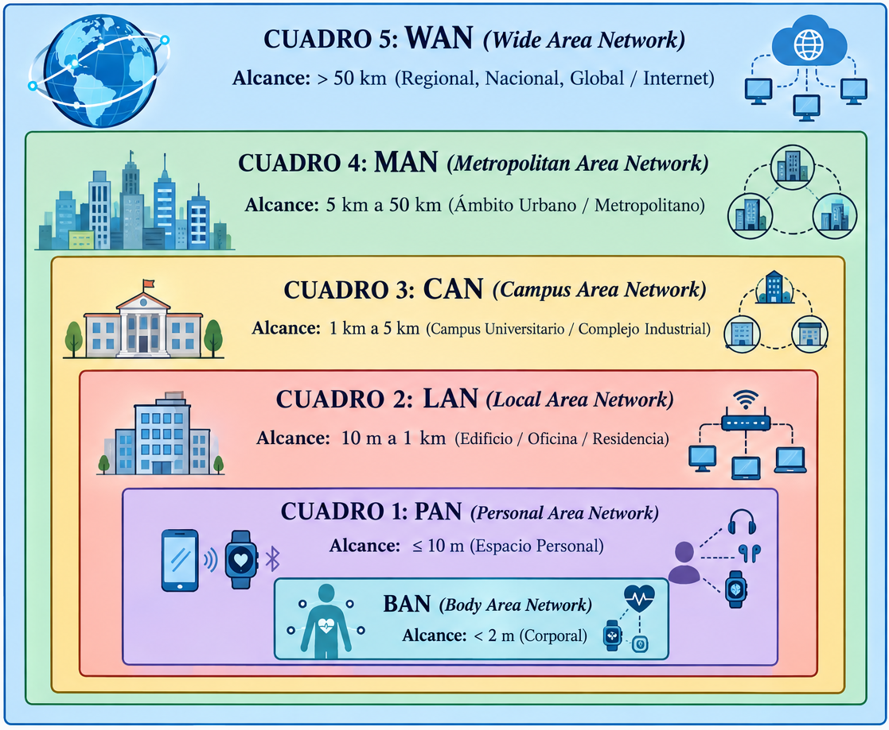

---

### Fundamentos y Clasificación de Redes LAN Virtuales (VLANs)

Una **VLAN** (*Virtual Local Area Network*) es un dominio de difusión (*broadcast domain*) lógico independiente creado sobre una infraestructura física de conmutación de Capa 2. Permite agrupar dispositivos de red en la misma subred lógica sin importar si están conectados al mismo switch físico o a conmutadores situados en ubicaciones distantes.

### Propósitos y Beneficios Fundamentales

1. **Aislamiento del Dominio de Difusión:** En una red conmutada tradicional, las tramas de difusión (*broadcast*) y multidifusión (*multicast*) se entregan a todos los puertos del switch. Una VLAN delimita el alcance de estas tramas únicamente a los hosts que forman parte de dicha VLAN, reduciendo la congestión y previniendo tormentas de difusión.
2. **Seguridad y Control de Acceso:** La comunicación directa en Capa 2 entre hosts de diferentes VLANs está completamente bloqueada. Para comunicar distintas VLANs se requiere obligatoriamente un dispositivo de Capa 3 (router o switch L3), lo que permite aplicar listas de control de acceso (ACLs) y políticas de seguridad estrictas.
3. **Flexibilidad Organizativa:** Permite reorganizar la estructura lógica de los departamentos o usuarios mediante software de administración sin tener que modificar físicamente el cableado de la infraestructura.

### Clasificación según el Método de Asignación (*Membership*)

* **VLANs Basadas en Puertos (Estáticas):** El administrador asigna manualmente cada puerto físico del switch a una VLAN específica. Es el método más utilizado debido a su simplicidad operativa.
* **VLANs Basadas en Direcciones MAC (Dinámicas):** Los puertos se asignan dinámicamente según la dirección MAC del dispositivo que se conecta. Cuando un host se enchufa a cualquier puerto, el switch consulta su base de datos y le asigna la VLAN correspondiente.
* **VLANs Basadas en Protocolo (Capa 3):** Clasifican el tráfico evaluando el campo EtherType de la cabecera de la trama (por ejemplo, separando tráfico IPv4 de IPv6).
* **VLANs Basadas en Subred IP (Capa 3):** Evalúan la dirección IP de origen o la subred a la que pertenece el paquete para asignarle automáticamente la VLAN adecuada.

### Clasificación según el Rol Funcional del Tráfico

* **VLAN de Datos / Usuario:** Transporta exclusivamente el tráfico de datos generado por los usuarios finales (navegación web, correo electrónico, transferencia de archivos).
* **VLAN Por Defecto (** **Default VLAN** **):** Es la VLAN configurada de fábrica en el conmutador a la que pertenecen inicialmente todos los puertos (típicamente la VLAN 1).
* **VLAN Nativa:** Utilizada en los enlaces troncales 802.1Q para transportar tramas que **no llevan etiqueta** (*untagged*). Garantiza la compatibilidad con dispositivos que no soportan etiquetado o para tráfico de control del switch.
* **VLAN de Administración (** **Management VLAN** **):** Red reservada específicamente para el acceso y gestión remota del conmutador (mediante SSH, SNMP o HTTPS) a través de una interfaz virtual de conmutación (SVI).
* **VLAN de Voz (** **Voice VLAN** **):** VLAN dedicada al tráfico de telefonía IP (VoIP), configurada con mecanismos de Calidad de Servicio (QoS) para priorizar el tráfico de voz y minimizar el *jitter* y la latencia.

---

### Estándar IEEE 802.1Q y Mecanismo de Tagging

El estándar **IEEE 802.1Q** especifica el mecanismo universal para la multiplexación de múltiples VLANs sobre una única línea física de interconexión entre switches o entre un switch y un router, proceso denominado troncalización de VLANs (VLAN trunking).

**Relación con las VLANs** 
Sin el estándar IEEE 802.1Q, conectar dos conmutadores que albergan $N$ VLANs requeriría utilizar $N$ enlaces físicos y $N$ puertos dedicados en cada switch (un cable por cada VLAN). El protocolo 802.1Q resuelve este problema de escalabilidad mediante la troncalización: un único puerto y cable físico se configuran como un enlace troncal (trunk link) que pertenece a todas las VLANs y transporta el tráfico multiplexado de todas ellas.

## Mecanismo de *Tagging* (Etiquetado) en IEEE 802.1Q

El **Tagging** es el procedimiento mediante el cual el conmutador emisor inserta una etiqueta especial de 4 bytes (32 bits) dentro de la cabecera de la trama Ethernet original antes de transmitirla a través de un enlace troncal.

Al recibir la trama etiquetada en el extremo opuesto del enlace troncal, el conmutador receptor examina el identificador de la VLAN (**VLAN ID**) dentro de la etiqueta para determinar a qué VLAN pertenece la trama, encamina la información internamente y **remueve la etiqueta** (*untagging*) antes de entregarla al puerto de acceso del destinatario final. De este modo, los sistemas terminales reciben tramas Ethernet estándar sin modificaciones.

### Estructura de la Trama Ethernet Etiquetada (IEEE 802.1Q)

**Trama Ethernet II Convencional (** **Untagged** **\- Máximo 1518 bytes):**

```
+-------------------+-------------------+--------------------+------------------------+----------+
|  MAC Destino (6B) |   MAC Origen (6B) | EtherType/Len (2B) |     Datos / Carga Útil | FCS (4B) |
+-------------------+-------------------+--------------------+------------------------+----------+

```

**Trama Etiquetada IEEE 802.1Q (** **Tagged** **\- Máximo 1522 bytes):**

```
+-------------------+-------------------+----------------+--------------------+------------------------+----------+
|  MAC Destino (6B) |   MAC Origen (6B) | Tag 802.1Q(4B) | EtherType/Len (2B) |     Datos / Carga Útil | FCS (4B) |
+-------------------+-------------------+----------------+--------------------+------------------------+----------+
                                                |
            +-----------------------------------+-----------------------------------+
            |   TPID (16 bits)   |  PCP (3 bits)  | DEI (1 bit)     |  VID (12 bits)    |
            |       0x8100       | Prioridad QoS  | Descarte eleg.  |  VLAN ID (0-4095) |
            +--------------------+----------------+-----------------+-------------------+

```

**Campos de la Etiqueta 802.1Q (4 Bytes / 32 Bits)**
1. **TPID (Tag Protocol Identifier - 16 bits):** Contiene el valor hexadecimal fijo 0x8100, el cual indica la presencia de una cabecera de etiquetado VLAN IEEE 802.1Q.

2. **TCI (Tag Control Information - 16 bits):** 
    * **PCP (Priority Code Point - 3 bits):** Especifica la prioridad de la trama bajo el estándar IEEE 802.1p para aplicar políticas de Calidad de Servicio (QoS) en Capa 2 (ofrece 8 niveles de prioridad, de 0 a 7).
    
    - **DEI (Drop Eligible Indicator - 1 bit):** Anteriormente conocido como CFI (Canonical Format Indicator), indica si la trama puede ser descartada en presencia de congestión en la red.
    
    * **VID (VLAN Identifier - 12 bits):** Identifica de manera unívoca la VLAN a la que pertenece la trama29. Al disponer de 12 bits, permite definir hasta $2^{12} = 4096$ VLANs (con un rango operativo útil de 1 a 4094).
    
**Consideraciones Operativas de la Cabecera 802.1Q**
* **Extensión de Tamaño de Trama:** La inclusión de la etiqueta de 4 bytes incrementa el tamaño máximo de la trama Ethernet de 1518 a 1522 bytes.
- **Recálculo del FCS:** Puesto que la cabecera de la trama se modifica al insertar la etiqueta, el switch emisor debe recalcular la secuencia de comprobación de trama (FCS / CRC-32) antes de enviarla por el puerto troncal.

---

## Implementación Básica de Conmutación y Segmentación por VLANs

Topología de Red y Tabla de Direccionamiento a implementar:

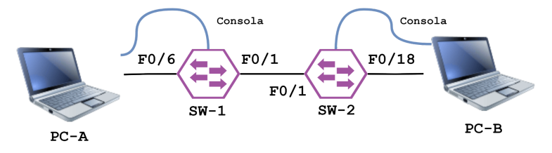
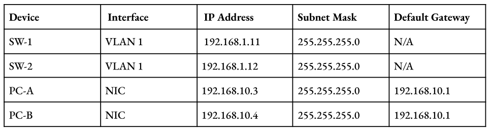

---

Topología implementada:

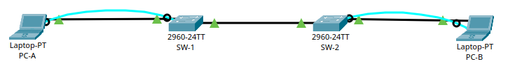

### Configuración de Seguridad Básica y Direccionamiento en Switches

Se realizó la configuración inicial y el endurecimiento (*hardening*) de la seguridad en los switches `SW-1` y `SW-2` aplicando las convenciones de administración estándar de Cisco IOS.

#### 1. Protección de Accesos y Cifrado de Credenciales
Se configuraron las credenciales de administración para restringir el acceso local y remoto en ambos dispositivos:
- **Modo EXEC Privilegiado:** Se asignó la contraseña protegida `class` mediante el comando `enable secret`.
- **Líneas de Consola y VTY (`0 15`):** Se aseguró el acceso físico por puerto serial y el acceso remoto por red mediante la clave `cisco` y la directiva `login`.

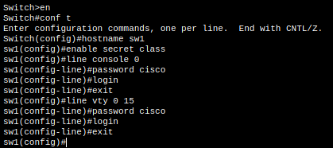

Para evitar la exposición de credenciales en texto plano al inspeccionar el archivo de configuración activa (`running-config`), se habilitó la función global `service password-encryption`. Este mecanismo aplica un algoritmo de cifrado reversible sobre todas las contraseñas almacenadas no encriptadas.

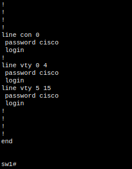
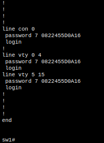

#### 2. Configuración de redes VLAN

Se habilitó la Interfaz Virtual de Switch (SVI) sobre la VLAN 1 por defecto para permitir la administración remota Nivel 3 de los switches según la tabla de direccionamiento provista.

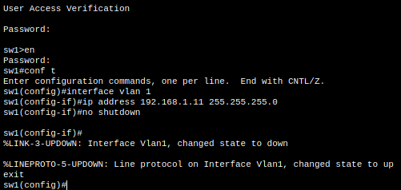
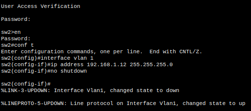


#### 3. Desactivación Preventiva de Puertos Inactivos

Como principio fundamental de seguridad en la Capa de Enlace, se apagaron administrativamente todas las interfaces físicas que no intervienen en la topología mediante la orden shutdown. Esta medida previene conexiones no autorizadas o ataques de acceso físico a la red.

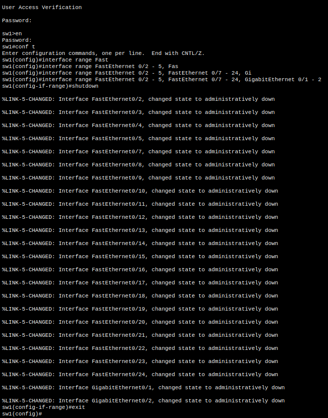
.png)

Para el caso de SW-2:
```
sw2(config)# interface range FastEthernet 0/2 - 17, FastEthernet 0/19 - 24, GigabitEthernet 0/1 - 2
sw2(config-if-range)# shutdown
sw2(config-if-range)# exit
```

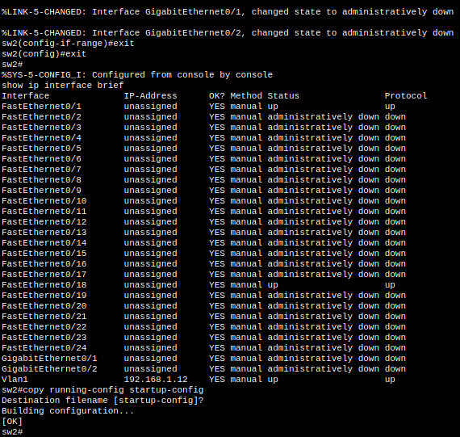

Posteriormente, se respaldaron las configuraciones en la memoria NVRAM de ambos conmutadores ejecutando la orden: `sw1# copy running-config startup-config`

se realizó una prueba de conectividad ICMP (`ping`) desde la PC-A (`192.168.10.3`) hacia la PC-B (`192.168.10.4`).
- Resultado: Exitoso (0% de pérdida de paquetes).

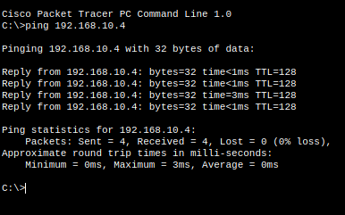

- Justificación Técnica: Al inicio del laboratorio, los puertos `F0/6` (SW-1), `F0/18` (SW-2) y la interfaz inter-switch `F0/1` formaban parte de la VLAN 1 por defecto. Al pertenecer a un único dominio de broadcast a Nivel 2 y compartir la subred IP `192.168.10.0/24`, las tramas Ethernet se conmutaron entre switches sin impedimentos.

#### Creación e identificación de VLANs

Con el objeto de aislar los dominios de broadcast y segmentar el tráfico, se definieron tres VLANs independientes y se reasignaron las interfaces físicas y virtuales.

Se crearon e identificaron las siguientes VLANs en ambos switches:
- VLAN 10 (Laboratorio)
- VLAN 20 (Bar)
- VLAN 99 (Management)

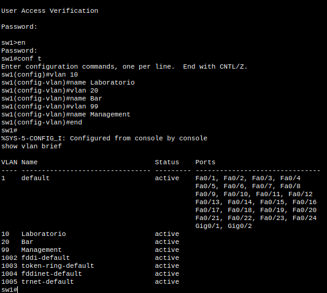

#### Asignación de Puertos de Acceso

Se asociaron los puertos donde se encuentran conectadas las computadoras a la VLAN 10 en modo acceso (`access`), garantizando que las tramas ingresadas por dichos puertos pertenezcan únicamente a ese dominio de broadcast:

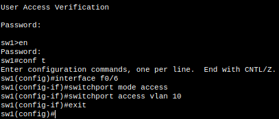

Para el caso de SW-2:
```
sw2(config)# interface FastEthernet 0/18
sw2(config-if)# switchport mode access
sw2(config-if)# switchport access vlan 10
```

#### Migración de la SVI a la VLAN 99

Para evitar el uso de la VLAN 1 nativa en la gestión de red, se removió la dirección IP asignada a la `interface vlan 1` y se reconfiguró la SVI dentro de la VLAN 99:

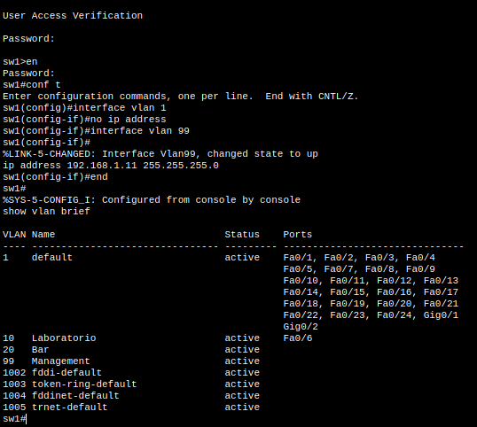
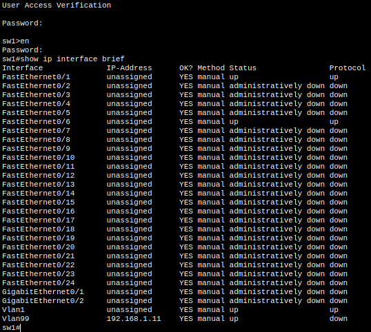

1. **Análisis de la Tabla de VLANs (`show vlan brief`):**
   - **Segmentación Lógica:** Se confirma la presencia de las VLANs `10` (*Laboratorio*), `20` (*Bar*) y `99` (*Management*) en estado activo dentro de la base de datos de conmutación.
   - **Asignación de Puertos de Acceso:** La interfaz física `F0/6` en `SW-1` (y `F0/18` en `SW-2`) figura asignada correctamente a la **VLAN 10**, habiendo sido desvinculada de la VLAN 1 nativa.
   * **Ausencia de Puertos en VLAN 99:** La **VLAN 99** se encuentra dada de alta pero no registra ningún puerto físico de acceso mapeado directamente a ella.

2. **Análisis del Estado de Interfaces (`show ip interface brief`):**
   - **SVI VLAN 1:** Muestra su estado en `unassigned` y `administratively down`, confirmando que se removió con éxito la IP de gestión de la VLAN por defecto para reducir vulnerabilidades.
   - **SVI VLAN 99:** La interfaz virtual registra asignada la dirección IP de administración de Nivel 3 (`192.168.1.11` en `SW-1` / `192.168.1.12` en `SW-2`) con estado administrativo encendido (`Status: up`). Sin embargo, su protocolo de línea figura como **`down`** (`Protocol: down`). Una Interfaz Virtual de Switch (**SVI**) requiere cumplir la condición de **asociación física activa** para pasar al estado operacional `up/up`. Esto significa que el switch debe detectar al menos un puerto físico en estado activo (*up/up*) que pertenezca a la VLAN 99. Al no existir puertos de acceso asignados a la VLAN 99, la SVI 99 carece de una Capa de Enlace subyacente activa, por lo que su protocolo de comunicación permanece en estado **`down`** e impide procesar paquetes IP.

### Análisis de Conectividad y Verificación de la Capa de Enlace
Tras reasignar los puertos de los hosts a la VLAN 10 y migrar las IP de gestión a la VLAN 99, se repitieron las pruebas de transmisión ICMP:

1. Prueba entre PC-A $\rightarrow$ PC-B:
   - Comando en PC-A: ping 192.168.10.4
   - Resultado: Fallido (Request timed out - 100% de pérdida).
    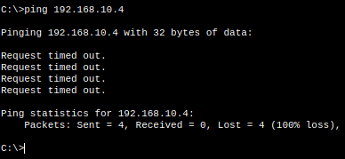

2. Prueba entre SW-1 $\rightarrow$ SW-2:
   - Comando en SW-1: ping 192.168.1.12
   - Resultado: Fallido (Success rate is 0 percent).
    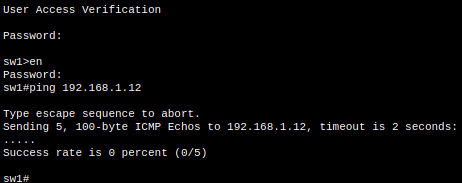

#### Diagnóstico de la Falla de Conectividad entre PC-A y PC-B (VLAN 10)

Al reasignar los puertos de **PC-A** y **PC-B** a la **VLAN 10** (*Laboratorio*), ambas computadoras quedaron aisladas en un nuevo dominio de broadcast virtual, separándose de la red por defecto (**VLAN 1**). 

Para que dos computadoras ubicadas en switches distintos puedan comunicarse dentro de una misma VLAN, el cable físico de interconexión (`FastEthernet 0/1`) debe estar habilitado para transportar el tráfico de ese grupo específico.

Sin embargo, la interfaz `F0/1` permanece configurada en **modo acceso dentro de la VLAN 1**. Esto provoca que el puerto funcione como una barrera para cualquier otra VLAN:

- **Bloqueo en el switch de origen:** Cuando la **PC-A** genera un paquete hacia la **PC-B**, el switch `SW-1` recibe los datos pertenecientes a la **VLAN 10**.
- **Incompatibilidad en el puerto de salida:** Al intentar reenviar la información hacia `SW-2` por la interfaz `F0/1`, `SW-1` detecta que dicho puerto solo permite el paso de tráfico de la **VLAN 1**.
- **Descarte de tráfico:** Al no coincidir las VLANs, `SW-1` descarta el paquete inmediatamente antes de que pueda salir por el cable físico.

En consecuencia, el tráfico de la **VLAN 10** nunca llega a cruzar hacia `SW-2`, dejando a las computadoras completamente incomunicadas.

#### Diagnóstico de la Falla de Conectividad entre Switches (VLAN 99)

Las direcciones IP de administración (`192.168.1.11` y `192.168.1.12`) se configuraron en las interfaces virtuales de la **VLAN 99** en ambos switches. Sin embargo, la prueba de `ping` entre `SW-1` y `SW-2` falla por lo siguiente:

- **Sin puertos físicos asignados:** Ninguno de los dos switches tiene un puerto físico donde haya dispositivos conectados asignado a la **VLAN 99**.
- **El cable de enlace no la transporta:** El puerto inter-switch (`F0/1`) sigue operando en modo acceso para la **VLAN 1**, por lo que no puede enviar tráfico de la **VLAN 99** hacia el otro switch.
- **La interfaz virtual permanece caída:** Para que la interfaz virtual de un switch (`interface vlan 99`) se active operativamente, necesita tener al menos un puerto físico activo asociado a esa misma VLAN. Al no haber ningún puerto funcionando en la VLAN 99, la interfaz lógica se mantiene en estado **caído (`line protocol is down`)**.

Al estar la interfaz de gestión inactiva por falta de conexión física, el conmutador no puede procesar paquetes IP en esa red, haciendo imposible la comunicación de administración entre `SW-1` y `SW-2`.

---

## Despliegue y Arquitectura de Red LAN a Bordo de una Aeronave

### Diseño Arquitectónico, VLANs y Servidor de Entretenimiento Local

### Ruteo Inter-VLAN (Router-on-a-Stick), Servicio DHCP y Traducción NAT

### Políticas de Control de Acceso mediante Listas de Control de Acceso (ACL)

### Matriz de Pruebas, Validación de Tráfico y Resultados

---

## Conclusión

---

## Referencias